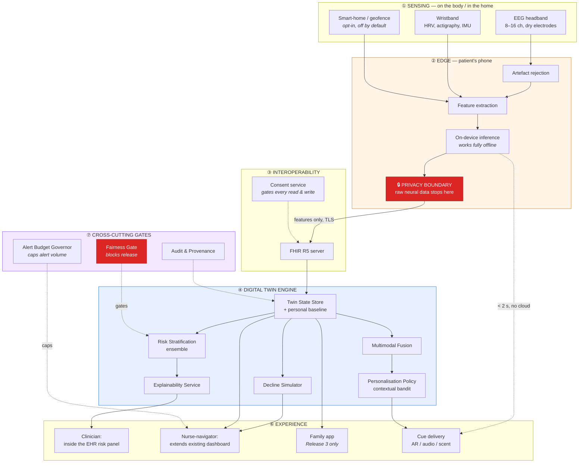

# AI, Digital Twins & Brain-Computer Interfaces in Dementia Care

### Technical Reference Architecture — Digital Twin Engine (DTE) & Memory Anchoring Pipeline (MAP)

**Author:** Kishan Das · **Institution:** Golden Gate University
**Supervisor:** Dorien Herremans, PhD — Associate Professor, Lead AMAAI Lab, Singapore University of Technology and Design

[](LICENSE)
[](DISCLAIMER.md)
[](DISCLAIMER.md)
[](src/dte/data/synthetic.py)
[](pyproject.toml)

---

## ⚠️ Read this before anything else

> ### This is a blueprint, not a product. No patient has ever used it.
>
> **1. Not a medical device.** Not evaluated or cleared by the FDA, EMA, MHRA, CDSCO or any
> regulator. It must not inform any clinical decision about any real person.
>
> **2. Every number in this repository is one of two things**, and each is labelled where it appears:
>
> | | Meaning |
> |---|---|
> | 🟡 **ILLUSTRATIVE** | A worked example, from a narrative composite or from this repository's synthetic data generator. **No real patient contributed to it.** It shows what an evaluation *would look like* — not what happened. |
> | 🔵 **LITERATURE** | A figure from a published, cited study. It describes **someone else's** research, not this system. |
>
> **3. "St. Mercy Medical Center" is not a real hospital.** It is a narrative composite used
> throughout the source book as a teaching device. Any pilot table, participant count (`n=28`),
> outcome percentage or caregiver quote attributed to it — here or in the book — is an
> **illustrative worked example**. No clinical trial has been conducted. No real patient data has
> been collected. No IRB-approved study underlies any figure in this repository.
>
> **4. Nothing here is validated.** The benchmarks in
> [§7](docs/07-validation-and-benchmarks.md) are **targets a real system would have to hit before
> deployment**, not measurements.
>
> **Full detail: [`DISCLAIMER.md`](DISCLAIMER.md)** — please read it before citing anything.

---

## What this is

A complete, opinionated technical architecture for integrating **AI Digital Twins** and
**non-invasive Brain-Computer Interfaces** into the dementia care pathway — plus **runnable code**
that demonstrates the design on synthetic data.

It is the technical companion to Chapter 3 of the dissertation book *Vision Translation to
Technology Requirements*, and it exists because a good idea and a system someone will actually rely
on are separated by a great deal of unglamorous translation work.

### The idea in one paragraph

A person living with mild-to-moderate dementia is supported by a twin that runs on **a smartphone
and a caregiver** — no specialist hardware required. The twin maintains a continuously updated
statistical model of that specific person, built from **their own baseline rather than a
population average**, and tells a nurse-navigator when someone's daily pattern has drifted from
their own normal. Add a consumer wristband and the twin can also stratify clinical risk. Add an
EEG headband — optional, and only where it can be afforded and staffed — and it can additionally
decide, in real time, when the person is receptive to a personal memory cue.

**Each of those capabilities is gated on the sensing actually present**, evaluated fresh every
time. A twin cannot assert a claim its current sensing does not support, and there is no bypass.
See [§15 The Fidelity Ladder](docs/15-fidelity-ladder.md).

> **The Memory Anchoring Pipeline (MAP)** is the novel contribution: a real-time system that fuses
> context, physiology, neural state and a caregiver-curated content library to detect memory
> retrieval opportunities, and learns per-person what actually works. It is a **Tier 3**
> capability — it requires neural sensing, and below that tier it does not degrade to a weaker
> cue, it goes silent. It is also, candidly, the part of this architecture with the least
> evidence behind it and no route to reimbursement ([ADR-0011](docs/adr/0011-non-neural-core.md)).

---

## Start here

| If you are… | Read this | Time |
|---|---|---|
| **Just curious** | [§1 Architecture Overview](docs/01-architecture-overview.md) | 10 min |
| **A clinician or care leader** | [§2 Requirements](docs/02-requirements-and-traceability.md) → [§7 Validation](docs/07-validation-and-benchmarks.md) → [§10 Governance & Ethics](docs/10-governance-and-ethics.md) | 40 min |
| **An engineer** | [§1](docs/01-architecture-overview.md) → [§15 Fidelity Ladder](docs/15-fidelity-ladder.md) → [§3 DTE](docs/03-digital-twin-engine.md) → [§4 MAP](docs/04-memory-anchoring-pipeline.md) → [ADRs](docs/adr/) → run the code | 100 min |
| **A data / integration engineer** | [§5 Data Architecture](docs/05-data-architecture.md) → [`schemas/`](schemas/) → [§8 Security](docs/08-security-and-privacy.md) | 45 min |
| **A reviewer or examiner** | [§2 Traceability](docs/02-requirements-and-traceability.md) → [ADRs](docs/adr/) → [`docs/REFERENCES.md`](docs/REFERENCES.md) | 60 min |
| **Living with dementia, or caring for someone who is** | [§10 Governance & Ethics](docs/10-governance-and-ethics.md) — written without jargon | 15 min |

Full index with reading paths: **[`docs/README.md`](docs/README.md)**

---

## System architecture



### Two loops, running at very different speeds

|  | **Fast loop** (Memory Anchoring) | **Slow loop** (clinical risk & monitoring) |
|---|---|---|
| Question | "Is this person receptive to a cue *right now*?" | "Is this person's trajectory changing?" |
| Latency | 🟡 target < 2 seconds | 🟡 48 h (deviation) / quarterly (risk) |
| Runs on | The patient's phone, **fully offline** | Institutional server (4 vCPU, no GPU) |
| Primary user | Patient and family | Clinician and nurse-navigator |
| **Default behaviour** | **Silence.** A wrong cue is worse than no cue. | Show nothing until the gates pass. |

Both loops are built so the failure mode is *doing nothing* — never *doing something intrusive*.

---

## Ten design principles

Each is enforced somewhere concrete, not merely asserted.

| # | Principle | Enforced by |
|---|---|---|
| **P1** | Compare the patient to **themselves**, not to a population | `Baseline` requires 14 days before any alert; robust z-scores against personal history |
| **P2** | Raw neural data **never leaves the device** | No code path exists to upload it — [ADR-0002](docs/adr/0002-edge-first-neural-processing.md) |
| **P3** | A score without a reason gets ignored | `RiskOutput` **raises** on fewer than 3 ranked features — [ADR-0006](docs/adr/0006-explainability-as-a-hard-requirement.md) |
| **P4** | A model that fails a subgroup **fails** | Automated gate blocks release at >10 pt gap — [ADR-0007](docs/adr/0007-subgroup-fairness-gate.md) |
| **P5** | Alert volume is a **design constraint** | Ceiling agreed with the receiving team *before* launch; suppression is audited |
| **P6** | **Add** to the workflow; never replace it | Outputs live inside the EHR panel clinicians already open — [ADR-0005](docs/adr/0005-additive-not-replacement-workflow.md) |
| **P7** | Every requirement must benefit the **patient**, not only the institution | Enforced at the six-question requirement gate |
| **P8** | Consent is continuous, per-modality and **revocable without penalty** | Patient stop-command overrides caregiver settings |
| **P9** | Must run on a **modest server** — no GPU | Tree ensembles, CPU-only CI — [ADR-0004](docs/adr/0004-ensembles-over-deep-networks.md) |
| **P10** | Standards-based integration from **day one** | FHIR R5 canonical model — [ADR-0001](docs/adr/0001-fhir-r5-canonical-model.md) |
| **P11** | A twin may not claim more than its **current sensing** supports | Claim ceilings enforced per evaluation; `ClaimCeilingViolation` raises, no bypass — [ADR-0010](docs/adr/0010-tiered-fidelity-ladder.md) |
| **P12** | The **caregiver** is a patient, not a user | Zarit, PHQ-9 and time-to-institutionalisation are primary endpoints; carer anxiety gates release — [ADR-0012](docs/adr/0012-caregiver-outcomes-as-primary.md) |

---

## Quick start

```bash
git clone https://github.com/NeoCage/dementia-DTE-Architecture.git
cd github.com-dementia-DTE-Architecture

python -m venv .venv && source .venv/bin/activate   # Windows: .venv\Scripts\activate
make dev
make test        # 223 tests
```

### Run the Memory Anchoring Pipeline

```bash
make demo
```

🟡 **ILLUSTRATIVE OUTPUT — synthetic data, no real patient:**

```
[11:53] place=known-significant  theta_z=+1.70 agit=0.26 content=1
          context=0.91 neural=0.57 content=0.75 conf=0.60 tau=0.62
          gates[all-pass] -> SILENT (below confidence threshold)

[10:40] place=home               theta_z=+1.79 agit=0.82 content=4
          context=0.40 neural=0.60 content=1.00 conf=0.52 tau=0.62
          gates[FAILED:agitation] -> SILENT (hard gate failed: agitation 0.82 vs veto 0.70)

evaluations=12  cues delivered=2  silence rate=83.3%
```

That second entry is the architecture working as intended. A strong neural signal was **suppressed
because the person was agitated** — physiology acts as a hard veto, not a weighted vote. A
recall-optimising system would have fired there and made the evening worse.

### Other commands

```bash
make api                                        # local API + interactive docs at /docs
python -m dte.cli risk --patient-index 0        # a risk score with its ranked reasoning
python -m dte.cli fairness --n 2000 --noise 4.0 # watch the fairness gate block a release
python -m dte.cli signals --artefact-rate 0.9   # watch the quality gate refuse to infer
```

### Examples — one property each

```bash
PYTHONPATH=src python examples/01_agitation_veto.py        # blocked at maximal confidence
PYTHONPATH=src python examples/02_fairness_gate_blocks.py  # a PERFECT model, still blocked
PYTHONPATH=src python examples/03_personal_baseline.py     # same number, two verdicts
PYTHONPATH=src python examples/04_fhir_round_trip.py       # explanation travels with the score
```

---

## Repository layout

```
├── DISCLAIMER.md                    ← read first
├── docs/                            ← the architecture (12 documents + 9 ADRs)
│   ├── 01-architecture-overview.md      C4 context, seven tiers, design principles
│   ├── 02-requirements-and-traceability.md  the six-question gate; every component traced
│   ├── 03-digital-twin-engine.md        component design, failure modes
│   ├── 04-memory-anchoring-pipeline.md  the fast loop, in full
│   ├── 05-data-architecture.md          FHIR R5, flows, consent states, content library
│   ├── 06-ml-architecture.md            five-stage methodology, models, MLOps
│   ├── 07-validation-and-benchmarks.md  every numeric gate — and the weakest link
│   ├── 08-security-and-privacy.md       threat model, and what the code does NOT do
│   ├── 09-deployment-architecture.md    topology, scale economics, readiness
│   ├── 10-governance-and-ethics.md      accountability, consent, the hard questions
│   ├── 11-implementation-roadmap.md     six phases with real stop conditions
│   ├── 12-glossary.md                   every term, in plain language
│   ├── 15-fidelity-ladder.md            tiers, claim ceilings, scenario suite
│   └── adr/                             9 decision records — the "why", and what was rejected
├── schemas/
│   ├── fhir/                        11 FHIR R5 profiles and examples
│   └── json-schema/                 internal twin state document
├── .run/                            PyCharm run configurations (tests, scenario replay)
├── src/dte/                         runnable reference implementation
│   ├── signals/                     EEG / HRV / gait feature extraction + quality gates
│   ├── fusion/                      opportunity detector, Alert Budget Governor
│   ├── policy/                      contextual bandit cue selection
│   ├── models/                      risk ensemble, trajectory, deviation detection
│   ├── fairness/                    the subgroup gate
│   ├── data/                        synthetic generator, FHIR serialisation
│   ├── api/                         FastAPI demo (NOT for deployment)
│   ├── tiers.py                     fidelity ladder + claim ceilings (no bypass)
│   ├── twin.py                      twin state, personal baseline, consent, provenance
│   └── cli.py
├── tests/                           223 tests — several are executable safety specifications
│   └── fixtures/tier_scenarios.json 12 clinical scenarios, reviewable without reading Python
├── examples/                        4 focused demonstrations
├── notebooks/                       worked synthetic analysis, runs end-to-end
└── diagrams/                        Mermaid sources for export
```

---

## Design targets

🟡 **These are TARGETS a real system would have to meet before deployment. None is a measurement.**
Full detail and rationale: [§7 Validation & Benchmarks](docs/07-validation-and-benchmarks.md).

| ID | Target | Blocks release? |
|---|---|---|
| **B1.1** | Sensitivity for MCI→dementia conversion, 18-month window **≥ 80%** | ✅ |
| **B1.2** | False-positive rate **≤ 20%** | ✅ |
| **B1.3** | Max accuracy gap, any subgroup vs. population **≤ 10 pts** | ✅ **unconditionally** |
| **B1.5** | Explanation coverage **100%** of clinician-facing scores | ✅ |
| **B2.1** | Baseline deviation detected within **48 hours** | ✅ |
| **B2.2** | Weekly alert volume **≤ ceiling the receiving team agreed before launch** | ✅ |
| **B3.1** | Cue latency **< 2 s** (p95) | ✅ |
| **B3.2** | **Distress rate ≤ 1%** of delivered cues — the binding constraint on the MAP | ✅ |
| **B3.6** | Recall of opportunity detection — **no minimum, deliberately** | — |
| **B4.1** | Caregiver burden (12-item Zarit) | ✅ |
| **B4.2** | Caregiver depressive symptoms (PHQ-9) | ✅ |
| **B4.3** | Time to institutionalisation | ✅ |
| **B4.4** | **Carer anxiety at ≥6 months (GAD-7) — safety endpoint** | ✅ **blocks MAP release** |

**Targets are indexed by tier.** B1.x requires T2 (wristband physiology). B2.x requires T1
(smartphone ambient sensing). B3.x requires T3 (neural). B4.x applies from **T0** — a twin with
nothing but a caregiver report can still move caregiver burden, which is the point of having a
T0 at all. Full table: [§15](docs/15-fidelity-ladder.md).

B3.6 has no target on purpose. The system is *permitted to miss opportunities*. Setting a recall
target would push the threshold down and trade distress for coverage. That trade is refused.

For comparison, 🔵 **LITERATURE** — and these replace an earlier set of figures that could not be
verified (see [`docs/REFERENCES.md`](docs/REFERENCES.md#removed-in-the-july-2026-verification-pass)):

* Resting-state EEG plus event-related potentials reached an area under the curve of **0.89** and
  **77%** accuracy distinguishing mild cognitive impairment from controls, with individual-level
  test–retest reliability of ICC **0.84** [16].
* A multimodal random-forest model across 277 participants reached AUC **0.98** for established
  Alzheimer's disease but only **0.84** at the mild cognitive impairment stage and **0.78** for
  subjective cognitive decline [4] — performance is strongly stage-dependent, and weakest where the
  clinical decision actually sits.
* A systematic review of 172 articles covering 234 experiments found that nearly a quarter had no
  held-out test set or used it for feature selection, and that short-horizon predictions may be no
  better than predicting the person stays stable [17].

Those are *other people's results on related tasks* — anchors for what "meaningfully better than the
status quo" means, not promises about this system.

---

## The weakest link — stated plainly

A reference architecture that hides its own weakest assumption is not useful.

> **The inference from "theta-band power is elevated relative to this person's baseline" to "this
> person is receptive to a memory cue right now" is the least well-evidenced link in the entire
> system.**

This is no longer a caveat buried in the validation chapter. It is now the organising principle of
the architecture. Because the neural channel is the weakest link, it lives in an **optional tier**
that has to earn its cost, rather than in the spine ([ADR-0011](docs/adr/0011-non-neural-core.md)).

Two published findings forced that change, and neither is about adherence — people with mild
dementia *will* wear a headband, at around 77% adherence over 52 weeks:

* Resting-state EEG classifiers reach ~AUC 0.85 for established Alzheimer's disease but **~AUC
  0.60 for mild cognitive impairment** — near chance, in exactly the population this system
  targets (Meghdadi et al., 2021, *PLoS ONE* 16(2):e0244180).
* A plasma p-tau217 blood test achieved **91%** diagnostic accuracy against **73%** for dementia
  specialists and **61%** for primary care physicians (Palmqvist et al., 2024, *JAMA*
  332(15):1245–1257).

It is plausible and literature-supported **at the group level**. It is **not established** at the
single-trial, single-person, real-time level — which is exactly what the MAP relies on.

### The most valuable experiment anyone could run

**Disable the neural channel** and see whether detection precision degrades. If it does not, the EEG
headset is adding cost, patient burden and privacy risk for nothing, and the architecture becomes
simpler, cheaper and less invasive.

**A negative result would be a good outcome.** If you run it, please
[open an issue](../../issues) — especially if the answer is no. Details and a sham-control design:
[§7.6](docs/07-validation-and-benchmarks.md#76-the-weakest-link).

---

## What this deliberately does *not* do

| Excluded | Why |
|---|---|
| **Invasive BCI** | Better signal, but nobody submits to repeated invasive sampling for monitoring — which makes the better signal irrelevant in practice |
| **Blood biomarkers as a precondition** | Requiring an extra test at intake excludes exactly the patients most likely to be missed ([ADR-0009](docs/adr/0009-no-biomarker-precondition.md)) |
| **Autonomous clinical action** | Never orders, prescribes, escalates or calls emergency services. It informs a named human |
| **Diagnosis** | The output is a risk estimate, and the patient-facing language says so explicitly |
| **Generative conversational agents** | The failure modes of an LLM improvising with a cognitively vulnerable person are not adequately characterised |
| **Late-stage dementia** | Designed for CDR 0.5–1.0 |
| **Federated learning (in code)** | Documented in [ADR-0003](docs/adr/0003-federated-learning-over-central-pooling.md), **not implemented**. Said plainly because a diagram is often mistaken for working software |

The demo API also implements **no authentication, no TLS, no encryption, no audit logging and no
consent enforcement**. It is a localhost demonstration. See
[§8.9](docs/08-security-and-privacy.md#89-what-the-reference-code-does-not-do).

---

## Ethical position

> **The person living with dementia is a participant with standing to refuse, not a monitored
> object.**

That is not decoration. It has consequences you can point at in the code:

- A spoken or gestural **"stop" suspends all cueing for 24 hours** — no confirmation dialog, and it
  overrides caregiver settings.
- The patient can **remove content without the caregiver being notified**, because reporting every
  removal turns a right into a negotiation.
- **A proxy can enrol a patient but cannot override the patient's refusal in the moment.**
  Behavioural assent is dispositive regardless of paperwork.
- Location tracking is **opt-in, off by default**, with the shortest re-confirmation cycle in the
  system.
- Distress is weighted **−2.0** against **+1.0** for successful recall. The policy is mathematically
  biased toward silence.

Read [§10 Governance & Ethics](docs/10-governance-and-ethics.md) for the questions this system
cannot dodge — including who is accountable when the algorithm is wrong, and whether any of this
will be affordable outside well-resourced academic centres.

If you fork this work, please carry that position with it.

---

## Contributing

Contributions are welcome, and the rules are stricter than a typical repository.

**Three hard rules** ([`CONTRIBUTING.md`](CONTRIBUTING.md)):

1. **Never contribute real patient data** — not raw, not aggregated, not "de-identified". EEG and
   gait signals are increasingly understood to be re-identifiable.
2. **Never present a number as a clinical result.** Label it 🟡 ILLUSTRATIVE or 🔵 LITERATURE.
3. **Never weaken a safety, fairness or consent control without an ADR.**

### Clinical and lived-experience review is the most valuable contribution

If you are a clinician, a person living with a dementia diagnosis, or a caregiver, your critique
matters more to this project than a code contribution, and needs no technical knowledge. The
specification says the system should stay silent rather than intrude — whether it *feels* that way
on a difficult afternoon is not something a benchmark table can determine.

[Open a review issue →](../../issues/new?template=clinical-review.yml)

---

## Citing this work

Cite it as **a proposed architecture and a methodology**. Please do not cite any figure in it as a
clinical result — doing so would misrepresent the evidence base.

```bibtex
@misc{das2026dte,
  title  = {Dementia Digital Twin Engine (DTE) Reference Architecture},
  author = {Das, Kishan},
  year   = {2026},
  note   = {Companion to the DBA dissertation book. Reference architecture;
            contains no real patient data. All quantitative examples are illustrative.},
  url    = {https://github.com/NeoCage/dementia-DTE-Architecture}
}

@book{das2026aidigitaltwins,
  title       = {AI, Digital Twins, and Brain-Computer Interfaces in Dementia Care:
                 For the Future of Neuroscience and Healthcare},
  author      = {Das, Kishan},
  year        = {2026},
  institution = {Golden Gate University}
}
```

Machine-readable metadata: [`CITATION.cff`](CITATION.cff)

---

## License

**[Apache License 2.0](LICENSE)**, with a [`NOTICE`](NOTICE) file carrying an explicit
**not a medical device** declaration.

Permissive by intent: the populations that most need this technology are concentrated where
resources are thinnest, and a restrictive licence would be one more barrier.

**Why Apache 2.0 rather than MIT.** Apache 2.0 is equally permissive but adds two things that matter
in this specific domain:

- **An express patent grant (§3).** This work sits in a field with an active patent landscape — the
  source book devotes a chapter to it. Under MIT, a contributor could license their code and later
  assert a patent covering the same technique. Apache 2.0 forecloses that, and includes a
  retaliation clause: a contributor who sues over patents in the Work loses their own grant. For a
  reference architecture intended to be *built on*, that certainty is the point.
- **A `NOTICE` mechanism (§4d).** Downstream distributors must carry the NOTICE file forward, which
  means the "not a medical device" declaration and the "no real patient data" statement travel with
  every fork rather than being quietly dropped.

Any fork used clinically must complete its own validation, regulatory pathway and ethics approval.
The licence permits that; nothing here substitutes for it, and §7 and §8 disclaim warranty and
liability accordingly.

## Contact

**Kishan Das** · [LinkedIn](https://www.linkedin.com/in/daskishan11/)
Research context: AMAAI Lab, Singapore University of Technology and Design

---

<div align="center">

*"We don't just predict decline. We preserve identity."*

**But we have not proven it yet — and this repository is careful to say so.**

[Read the disclaimer](DISCLAIMER.md) · [Read the architecture](docs/README.md) · [Challenge it](../../issues)

</div>
