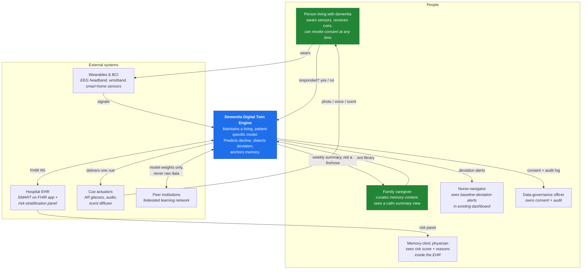
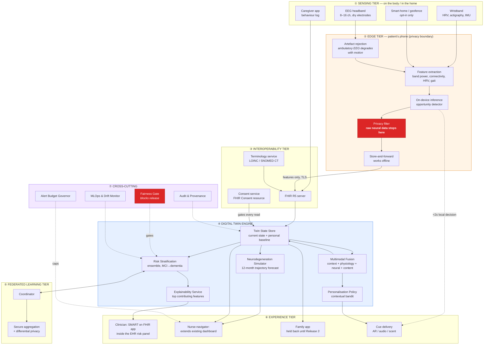
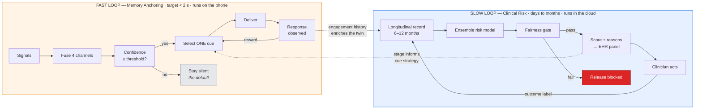

# 1. Architecture Overview

> ⚠️ Reference architecture only. Not a medical device. See [`../DISCLAIMER.md`](../DISCLAIMER.md).

---

## 1.1 What this system is, in one paragraph

A person living with mild-to-moderate dementia is supported by a continuously updated statistical
model of themselves — their **Digital Twin** — built from **their own baseline rather than a
population average**.

What the twin can do depends on what sensing is actually available, and that is a design decision
rather than an accident. In its **base configuration it needs only a smartphone and a caregiver**:
passive signals stream to a phone which cleans them and extracts features **on the device**, and
the twin tells a nurse-navigator when the person's day-to-day pattern has drifted meaningfully from
their own normal. Add a consumer wristband and the twin can additionally flag to a clinician when
the person looks likely to progress from mild cognitive impairment toward dementia. Add a
non-invasive EEG headband — **optional, and only where it can be afforded and staffed** — and it
can also decide in real time when the person is receptive to a personal memory cue: a photograph, a
voice recording, a familiar scent.

Each of those capabilities is gated on the sensing present *at that moment*. A twin whose headband
is off is not a twin making weaker neural claims; it is a twin making no neural claims at all
([§15](15-fidelity-ladder.md)).

Everything else in this repository is detail about how to do that safely, fairly, and in a way a
real clinician will actually use.

## 1.2 The problem being solved

Dementia affects roughly 57 million people worldwide, projected to reach 152 million by 2050
(🔵 LITERATURE [1]). Three failures in the current care pathway motivate this architecture:

| Failure | What it looks like in practice | Consequence |
|---|---|---|
| **Late detection** | Annual MMSE or MoCA screening catches decline only after it has already taken something from the patient. | Avoidable emergency visits; unplanned nursing-home placement; caregiver burnout nobody saw coming. |
| **Reactive monitoring** | For people living at home, the default is that someone calls when something has visibly gone wrong. | The fall, the wandering episode or the missed medication has already happened. |
| **Generic cognitive support** | Reminder apps treat every patient as interchangeable. | Tools get abandoned; the person's own history — the thing that actually cues recall — goes unused. |

A fourth failure is organisational rather than clinical, and it is the one this architecture takes
most seriously: **well-validated tools get abandoned because deployment was treated as an
afterthought.** The literature on cross-population deployment documents real efficacy losses when
alerting logic tuned on one group is applied unmodified to a more diverse one (🔵 LITERATURE [14]),
and monitoring pilots have been abandoned not because the model was wrong but because nobody checked
whether the alert volume was survivable for the humans receiving it.

Every structural decision here is downstream of that fourth failure. See
[ADR-0005: Additive, not replacement, workflow integration](adr/0005-additive-not-replacement-workflow.md).

## 1.2a Two different things are called "tiers" — disambiguation

This documentation uses the word *tier* in two unrelated senses, and confusing them will mislead.

| Term | Meaning | Where |
|---|---|---|
| **Architectural tier** | One of the seven horizontal layers of the system — sensing, edge, interoperability, twin engine, and so on. A structural decomposition. | §1.5 |
| **Fidelity tier (T0–T3)** | How much sensing is available for a given patient at a given moment, and therefore what the twin is permitted to claim. | [§15](15-fidelity-ladder.md) |

Where ambiguity is possible this documentation writes **"fidelity tier"** or uses the explicit
labels **T0 / T1 / T2 / T3**. An unqualified "tier" in a structural context means an architectural
layer.

## 1.2b The deployable configuration

The system does **not** require neural hardware. Its base configuration is a smartphone and a
caregiver, and each additional sensing modality unlocks additional claims rather than being a
precondition for the system to function at all
([ADR-0011](adr/0011-non-neural-core.md), [§15](15-fidelity-ladder.md)).

| Fidelity tier | Sensing | May claim |
|---|---|---|
| **T0** | Caregiver / clinician report | Care-plan support, burden tracking |
| **T1** | + smartphone ambient sensing | + deviation from personal baseline |
| **T2** | + consumer wristband | + MCI-to-dementia conversion risk |
| **T3** | + EEG headband *(optional)* | + real-time memory-cue opportunity |

Fidelity tier is **derived from live signal availability on every evaluation**, never configured at
enrolment. The claim ceiling is enforced in code with no bypass path.

## 1.3 Design principles

These are the non-negotiables. Each one is enforced somewhere concrete in the architecture, not just
asserted here.

| # | Principle | Where it is enforced |
|---|---|---|
| **P1** | **Compare the patient to themselves, not to a population.** Deviation from personal baseline is the primary signal. | `TwinState.baseline` in [§3](03-digital-twin-engine.md); `src/dte/models/decline.py` |
| **P2** | **Neural data never leaves the edge in raw form.** Only derived features travel. | [ADR-0002](adr/0002-edge-first-neural-processing.md); [§8](08-security-and-privacy.md) |
| **P3** | **A score without a reason gets ignored.** Every clinician-facing output carries its top contributing features. | [ADR-0006](adr/0006-explainability-as-a-hard-requirement.md); `src/dte/models/risk.py` |
| **P4** | **A model that fails a subgroup fails.** A >10 percentage-point accuracy gap blocks release. | [§7](07-validation-and-benchmarks.md); `src/dte/fairness/subgroup.py` |
| **P5** | **Alert volume is a design constraint, not an outcome.** The receiving team sets the ceiling before launch. | [§7](07-validation-and-benchmarks.md); `AlertBudget` in `src/dte/fusion/detector.py` |
| **P6** | **Add to the workflow; do not replace it.** Outputs appear inside tools clinicians already open. | [ADR-0005](adr/0005-additive-not-replacement-workflow.md); [§9](09-deployment-architecture.md) |
| **P7** | **Every requirement must benefit the patient or family, not only the institution.** | [§2](02-requirements-and-traceability.md) |
| **P8** | **Consent is continuous and revocable, and revoking it must be easy.** | [§8](08-security-and-privacy.md); [§10](10-governance-and-ethics.md) |
| **P9** | **Run on a modest server.** If it needs a GPU cluster, community health systems cannot use it. | [ADR-0004](adr/0004-ensembles-over-deep-networks.md) |
| **P11** | A twin may not claim more than its **current sensing** supports | Claim ceilings, enforced per evaluation — [ADR-0010](adr/0010-tiered-fidelity-ladder.md) |
| **P12** | The **caregiver** is a patient, not a user | Caregiver outcomes are primary endpoints — [ADR-0012](adr/0012-caregiver-outcomes-as-primary.md) |
| **P10** | **Standards-based integration from day one.** FHIR R5, not a bespoke format. | [ADR-0001](adr/0001-fhir-r5-canonical-model.md); [§5](05-data-architecture.md) |

## 1.4 System context (C4 Level 1)

Who and what the system talks to.

**Read the diagram this way:** the patient is at the centre of two loops. The *care* loop runs
through the clinician and nurse-navigator and is mediated by the EHR. The *memory* loop runs
directly between the sensors and the cue actuators, closing in under two seconds, and does not wait
for a clinician. The federated link carries model weights only — never a patient record.

## 1.5 The seven tiers (C4 Level 2 — containers)

### Why seven tiers and not fewer

The tier boundaries are not arbitrary layering. Each one exists because something specific must be
true at that line:

- **① → ②** is where unreliable hardware meets software that has to cope with it. Ambulatory EEG
  degrades materially with movement and electrode placement, so
  artefact rejection is a first-class tier concern, not a preprocessing footnote.
- **② → ③** is the **privacy boundary**. Raw neural time-series never crosses it. This is the single
  most consequential line in the architecture ([ADR-0002](adr/0002-edge-first-neural-processing.md)).
- **③ → ④** is the **standards boundary**. Everything above speaks FHIR R5, so a second or third
  use case does not require a second integration project
  ([ADR-0001](adr/0001-fhir-r5-canonical-model.md)).
- **④ → ⑥** is the **trust boundary**. No model output reaches a human without passing the
  explainability service and the alert budget governor.
- **⑦** is drawn as a separate tier rather than sprinkled through the others because the fairness
  gate and the alert budget have *authority to block a release*. Burying them inside a component
  makes them easy to skip, and the most common way this class of system fails is that someone skips
  them.

## 1.6 The two decision loops

The system has two loops running at very different speeds. Confusing them is the most common
misreading of this architecture.

| | Fast loop (MAP) | Slow loop (risk & monitoring) |
|---|---|---|
| **Question it answers** | "Is this person receptive to a cue *right now*?" | "Is this person's trajectory changing?" |
| **Latency budget** | < 2 seconds | 48 hours (deviation) / quarterly (risk) |
| **Where it runs** | Patient's phone, offline-capable | Cloud or on-premise DTE |
| **Primary user** | Patient and family | Clinician and nurse-navigator |
| **Default behaviour** | **Silence.** A wrong cue is worse than no cue. | Show nothing until the gate passes. |
| **Failure mode to avoid** | Nagging; cueing during agitation | Alert fatigue; unexplained scores |

That asymmetry — the fast loop defaults to silence, the slow loop defaults to showing nothing — is
deliberate. Both loops are designed so that the failure mode is *doing nothing*, never *doing
something intrusive*.

## 1.7 Quality attributes and how each is achieved

| Attribute | Target 🟡 | Mechanism |
|---|---|---|
| **Latency (cue)** | < 2 s from signal to cue | On-device inference; no cloud round-trip in the fast loop |
| **Latency (deviation)** | Clinically meaningful drift detected within 48 h | Rolling personal-baseline comparison, hourly evaluation |
| **Availability** | Fast loop functions fully offline | Edge store-and-forward; cloud is not on the critical path |
| **Privacy** | Zero raw neural time-series leaves the device | Hard privacy filter at the edge boundary |
| **Fairness** | ≤ 10 pt accuracy gap, any subgroup vs. population | Automated fairness gate with release-blocking authority |
| **Explainability** | 100% of clinician-facing scores carry top-3 features | Explainability service sits between model and UI |
| **Alert sustainability** | Weekly volume ≤ ceiling agreed by receiving team | Alert Budget Governor throttles before the human sees it |
| **Portability** | Runs on 4 vCPU / 16 GB, no GPU | Tree ensembles rather than deep networks ([ADR-0004](adr/0004-ensembles-over-deep-networks.md)) |
| **Interoperability** | All external exchange via FHIR R5 | Canonical model at the interop tier |
| **Auditability** | Every twin state change is attributable | Append-only provenance log |

## 1.8 What is deliberately out of scope

Being explicit about this is part of the architecture.

- **Invasive BCI.** Implanted electrodes give better signal. They are excluded because nobody will
  submit to repeated invasive sampling for a monitoring use case, which makes the better signal
  irrelevant in practice.
- **Blood-based biomarkers as a precondition.** They can add signal later. Requiring an extra test
  at intake tends to exclude exactly the patients most likely to be missed in the first place.
- **Autonomous clinical action.** The system never orders, prescribes, escalates or contacts
  emergency services on its own. It surfaces information to a named human.
- **Diagnosis.** The risk output is a risk estimate. The patient-facing language says so explicitly.
- **Generative conversational agents.** Out of scope for v1 — the failure modes of an LLM
  improvising with a cognitively vulnerable person are not adequately characterised.
- **Late-stage dementia.** Designed for CDR 0.5–1.0. Earlier, the support usually is not needed;
  later, it is not reliable.

## 1.9 Where to go next

- The three requirements that drove all of this: [§2 Requirements & Traceability](02-requirements-and-traceability.md)
- How the twin itself is built: [§3 Digital Twin Engine](03-digital-twin-engine.md)
- The fast loop in detail: [§4 Memory Anchoring Pipeline](04-memory-anchoring-pipeline.md)
- Why each big decision was made: [`adr/`](adr/)
