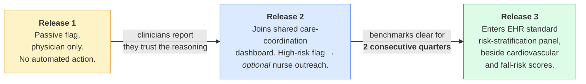

# 2. Requirements and Traceability

> ⚠️ Reference architecture only. See [`../DISCLAIMER.md`](../DISCLAIMER.md). "St. Mercy Medical
> Center" referenced below is a **narrative composite, not a real hospital**.

This document exists so that no component in this architecture is unexplained. If you find a service
in [§3](03-digital-twin-engine.md) and want to know why it exists, the traceability matrix in
[§2.6](#26-traceability-matrix) points back to the requirement that demanded it.

---

## 2.1 The gap that kills AI projects

Every AI initiative in dementia care starts with a mismatch worth naming plainly.

The vision is abstract: *deliver compassionate, technology-enabled care that preserves dignity and
independence.* The technology is not abstract at all. It is a specific model trained on a specific
dataset, a specific sensor a patient has to actually wear, a dashboard a specific nurse has to
actually open.

Somebody has to do the work of closing that gap. Most organisations discover, usually the hard way,
that nobody was assigned to.

🟡 **ILLUSTRATIVE — narrative composite.** The pattern this architecture is built to avoid: a health
system buys an EEG-based risk-scoring tool. The accuracy numbers are good. Nobody asks which
clinician will see the score, what they are supposed to do with it, or what happens to a patient
flagged high-risk who does not want to know. The tool sits unused. It takes almost a year to admit
it failed.

## 2.2 The six-question gate

No requirement enters this architecture until someone can answer six questions **out loud, in plain
language, to a room containing a clinician, a family representative and an engineer.**

| # | Question | What it forces you to confront |
|---|---|---|
| **Q1** | What do we do today without this, and what does that cost us? | Stops you from solving a problem nobody has. Forces the true cost — including the caregiver burnout that never appears in a screening-accuracy statistic. |
| **Q2** | What data would this actually need? | Kills requirements that depend on data you will never lawfully or practically obtain. |
| **Q3** | What number would tell us it's working? | Forces a measurable, pre-registered benchmark instead of a vibe. |
| **Q4** | How do we roll it out without betting the whole budget on day one? | Forces phasing with real go / no-go gates. |
| **Q5** | What does the person on the receiving end actually see? | Forces you to design the clinician view *and* the patient view, separately. |
| **Q6** | Whose job is it, by name, to make sure it works? | Converts "the vendor owns it" into six named accountable roles. |

This is a low bar on paper and a surprisingly hard one to enforce, mostly because it is slower than
trusting a vendor's accuracy slide. It is also the only bar that reliably predicts which projects
survive their first year.

**Architectural consequence:** Q3 becomes [§7 Validation & Benchmarks](07-validation-and-benchmarks.md).
Q4 becomes [§11 Implementation Roadmap](11-implementation-roadmap.md). Q5 becomes the Experience
Tier. Q6 becomes the RACI in [§10 Governance](10-governance-and-ethics.md#102-named-accountability).
The gate is not documentation *about* the architecture — it generates the architecture.

## 2.3 Requirement R1 — Earlier, more reliable MCI-to-dementia risk identification

**Statement.** Identify patients at elevated risk of progressing from mild cognitive impairment
(MCI) to dementia, earlier and more reliably than annual cognitive screening alone.

<b>Q1 — Current solution and cost of inaction</b>

Memory clinics rely on annual MMSE or MoCA screening, backed by clinical judgement. It is a
reasonable tool, and by its nature it only catches decline *after it has already taken something
from the patient*.

Late detection is not a paperwork problem. It reappears later as an avoidable emergency visit, a
nursing-home placement nobody had time to plan properly, and a caregiver who burns out before anyone
notices. None of that appears in a screening-accuracy statistic. All of it is real cost.

<b>Q2 — Data requirements</b>

Less exotic than most teams expect:

| Data | Rationale | Constraint |
|---|---|---|
| Resting-state EEG | Non-invasive, cheap, repeatable, strong evidence base as a dementia biomarker (🔵 [2][3]) | 8–16 channel dry-electrode headset; clinic-grade acquisition |
| Structured neuropsychological scores | Established clinical anchor | MMSE / MoCA / CDR, existing workflow |
| **≥ 2 visits spanning 6–12 months** | A single snapshot underperforms a short longitudinal record (🔵 [16]) | Longitudinal design is mandatory, not optional |
| Medication and comorbidity history | Confounder control | From EHR via FHIR |
| Blood-based biomarkers | Can add signal cheaply | **Deliberately excluded as a launch precondition** |

The last row is a design decision, not an oversight. Requiring an extra test at intake tends to
exclude exactly the patients most likely to be missed in the first place. See
[ADR-0009](adr/0009-no-biomarker-precondition.md).

<b>Q3 — Benchmarks (🟡 targets, not measurements)</b>

Three, chosen because a clinician can sanity-check each without trusting a black box:

| Benchmark | Target | Why this one |
|---|---|---|
| Sensitivity for MCI→dementia conversion | **≥ 80%** within an 18-month window | Missing a converter is the costly error |
| False-positive rate | **≤ 20%** (no more than 1 in 5 flagged patients turns out not to be progressing) | Above this, clinicians stop trusting the flag |
| Max subgroup accuracy gap | **≤ 10 percentage points** vs. population average | A design choice, not a figure inherited from the literature. The threshold is argued on its own terms in [ADR-0007](adr/0007-subgroup-fairness-gate.md); the earlier citation supporting a specific percentage loss could not be verified and has been removed |

The third benchmark has release-blocking authority. A benchmark that does not check for that gap
will not catch it before deployment.

<b>Q4 — Phased rollout</b>

Three releases, each earning the right to the next.

Release 1 deliberately attaches *no* automated action. The point is to let clinicians build trust in
the model's reasoning before it touches a single workflow decision.

<b>Q5 — What each person sees</b>

Two different products from one model output:

**The clinician sees** a risk score **plus the handful of EEG features that drove it most** — for
instance, elevated theta-band power. A number with no reasoning attached gets ignored, and
explainability has been shown to meaningfully raise clinician confidence in exactly this kind of tool
(🔵 [18]).

**The patient and family see** something different: a plain-language summary, developed jointly with
the hospital's patient-and-family advisory council, stating what the score means, what it does *not*
mean (**a risk estimate, not a diagnosis**), and what happens next. Nobody on that advisory council
is a data scientist. That is the point of including them.

<b>Q6 — Named accountability</b>

| Role | Owns |
|---|---|
| Neurologist or geriatrician | The clinical outcome |
| Data scientist **who understands EEG signal processing** — not a generalist | The model |
| Clinical informaticist | EHR integration |
| Nurse-navigator lead | The care-coordination workflow it feeds |
| Data-governance officer | Consent and privacy |
| Patient-and-family advisory representative | **Effective veto** over anything patient-facing |

🟡 The failed first attempt had none of these. It had a vendor and a contract.

## 2.4 Requirement R2 — Continuous, lower-burden home monitoring via a Digital Twin view

**Statement.** Give the care team a continuously updated view of how a community-dwelling patient is
doing *today, compared against their own baseline* — replacing reactive check-ins.

| Question | Answer |
|---|---|
| **Q1 Current solution** | Reactive: someone calls when something has visibly gone wrong, by which point a fall, wandering episode or missed medication has already happened. The Care Ecosystem model demonstrated across a real network of health systems that proactive, data-supported coordination improves caregiver well-being and patient quality of life while cutting avoidable hospital use (🔵 [7][20]). The Digital Twin layer makes that logic continuous rather than fortnightly. |
| **Q2 Data** | Wearable gait and heart-rate-variability data; geofence or smart-home location data **only where the family has actually consented**; a digitised caregiver-reported behaviour log; and a periodic validated caregiver-burden assessment — caregiver strain is itself among the strongest predictors of crisis-driven nursing-home placement (🔵 [15]). |
| **Q3 Benchmarks 🟡** | (a) A clinically meaningful deviation from the patient's **own** baseline — a sustained drop in gait speed, say — detected within **48 hours**. (b) A weekly alert volume per caseload **that the nurse-navigator team itself signed off on before launch.** |
| **Q4 Rollout** | Same three-release pattern as R1, with one deliberate exception: **the family-facing mobile view is held back until Release 3**, after alerting logic has been tuned on real data. |
| **Q5 What people see** | Nurse-navigator: deviation alerts inside the dashboard they already open. Family: a calm weekly summary, not a live feed. |
| **Q6 Ownership** | Nurse-navigator lead owns the workflow and the alert ceiling; data-governance officer owns the geofence consent. |

### Why benchmark (b) is an architectural component, not a policy

🟡 **ILLUSTRATIVE — narrative composite.** An earlier monitoring pilot was abandoned after six
weeks. Not because the model was wrong. Because nobody had checked whether the alert volume was
survivable for the humans receiving it.

That is why the **Alert Budget Governor** exists as a cross-cutting service with authority to
throttle ([§3.7](03-digital-twin-engine.md#37-alert-budget-governor)). Alert volume is treated as a
hard design constraint with a pre-agreed ceiling, not as an emergent property to be tuned after
go-live.

### Why the family view is held back

🟡 Showing a family a noisy, untuned signal in an early release had been tried once before, on the
abandoned pilot. It produced anxiety, not reassurance. The architecture encodes that lesson as a
release-ordering constraint.

## 2.5 Requirement R3 — Patient-facing cognitive engagement and memory support

**Statement.** Detect, in real time, moments when a patient with mild-to-moderate Alzheimer's is
likely receptive to a personalised memory cue, deliver that cue through a non-invasive channel, and
confirm afterwards with the patient or caregiver whether recall improved.

R3 differs from R1 and R2 in one important respect: **its primary customer is the patient and family,
not the clinician.** That changes what counts as success.

| Question | Answer |
|---|---|
| **Q1 Current solution** | Generic reminder apps. Caregiver-reported quality of life and recall outcomes improve meaningfully when patients get personalised, AI-supported memory tools instead — one mobile tool reported an 18% improvement in recall tasks, with a clear preference for personalised over generic content among both patients and caregivers (🔵 [25]). |
| **Q2 Data** | Context (location, time of day); physiology (HRV as a rough proxy for agitation that would make a cue counterproductive); neural state (theta-band EEG elevation, associated with memory-retrieval readiness, 🔵 [2]); and a **caregiver-curated personal content library** — a photo, a voice recording, something chosen for this specific person. |
| **Q3 Benchmarks 🟡** | Cue latency < 2 s; caregiver- or patient-confirmed recall improvement as the primary outcome; and a **precision-weighted** objective — silence is preferred over a wrong cue. |
| **Q4 Rollout** | Consented research context first, then supervised home use, then independent home use. |
| **Q5 What people see** | The patient sees **one** low-friction cue. Not a menu, not a notification stack. The caregiver sees the content library they curate and a summary of what worked. |
| **Q6 Ownership** | Patient-and-family advisory representative holds veto; occupational therapist or clinical psychologist owns the cue-content clinical appropriateness. |

### Scope boundary (population)

CDR **0.5 to 1.0**. Earlier than that, the support usually is not needed. Later, it usually is not
reliable. Naming the population is part of Stage 1 of the methodology in
[§6](06-ml-architecture.md).

### Worked scenario

A patient recently diagnosed with early Alzheimer's walks past a location that matters to his
personal history — for illustration, the courtyard where he proposed fifty years earlier. The system
must decide, in real time, whether this is a genuine memory-retrieval opportunity or simply a
coincidence. It does that by fusing four signal types, crossing a confidence threshold, delivering
**one** low-friction cue, then recording whether the patient actually responded — and using that
response to refine what works **for this specific person**, not for patients in general.

That scenario is the whole of [§4 Memory Anchoring Pipeline](04-memory-anchoring-pipeline.md).

## 2.6 Traceability matrix

Every component in the architecture, traced to the requirement that demanded it. If a component
appears here with no requirement, it should be deleted.

| Component | R1 | R2 | R3 | Design principle | Specified in |
|---|:--:|:--:|:--:|---|---|
| EEG acquisition + artefact rejection | ✅ | | ✅ | P2 | [§3.2](03-digital-twin-engine.md#32-signal-processing-service) |
| Wearable HRV / gait ingestion | | ✅ | ✅ | P1 | [§3.2](03-digital-twin-engine.md#32-signal-processing-service) |
| Geofence / smart-home (opt-in) | | ✅ | ✅ | P8 | [§5.4](05-data-architecture.md#54-consent-gated-flows) |
| Edge privacy filter | ✅ | ✅ | ✅ | **P2** | [ADR-0002](adr/0002-edge-first-neural-processing.md) |
| FHIR R5 interop tier | ✅ | ✅ | ✅ | P10 | [ADR-0001](adr/0001-fhir-r5-canonical-model.md) |
| Consent service | ✅ | ✅ | ✅ | P8 | [§8.5](08-security-and-privacy.md#85-consent-architecture) |
| Twin State Store + personal baseline | | ✅ | ✅ | **P1** | [§3.1](03-digital-twin-engine.md#31-twin-state-store) |
| Multimodal Fusion Service | | | ✅ | P1 | [§3.3](03-digital-twin-engine.md#33-multimodal-fusion-service) |
| Ensemble Risk Model | ✅ | | | P3, P9 | [§6.4](06-ml-architecture.md#64-stage-3--model-selection) |
| Neurodegeneration Simulator | ✅ | ✅ | | P1 | [§3.4](03-digital-twin-engine.md#34-neurodegeneration-simulator) |
| Personalisation Policy (bandit) | | | ✅ | P1 | [ADR-0008](adr/0008-contextual-bandit-for-cue-selection.md) |
| Explainability Service | ✅ | ✅ | | **P3** | [ADR-0006](adr/0006-explainability-as-a-hard-requirement.md) |
| Fairness Gate | ✅ | ✅ | ✅ | **P4** | [§7.4](07-validation-and-benchmarks.md#74-the-subgroup-fairness-gate) |
| Alert Budget Governor | | ✅ | | **P5** | [§3.7](03-digital-twin-engine.md#37-alert-budget-governor) |
| SMART on FHIR clinician app | ✅ | | | P6 | [§9.4](09-deployment-architecture.md#94-experience-tier-deployment) |
| Nurse-navigator dashboard extension | | ✅ | | **P6** | [ADR-0005](adr/0005-additive-not-replacement-workflow.md) |
| Family app (Release 3 only) | | ✅ | ✅ | P7 | [§11](11-implementation-roadmap.md) |
| Cue delivery (AR / audio / scent) | | | ✅ | P7 | [§4.5](04-memory-anchoring-pipeline.md#45-cue-delivery) |
| Content Library | | | ✅ | P7 | [§5.6](05-data-architecture.md#56-the-personal-content-library) |
| Federated Learning tier | ✅ | | | P2, P10 | [ADR-0003](adr/0003-federated-learning-over-central-pooling.md) |
| Audit & Provenance log | ✅ | ✅ | ✅ | P8 | [§8.6](08-security-and-privacy.md#86-audit-and-provenance) |
| Drift monitor | ✅ | ✅ | ✅ | P4 | [§6.7](06-ml-architecture.md#67-mlops-and-drift-monitoring) |

## 2.7 What unites the three requirements

It is not the technology underneath any of them. It is that **none was approved until someone could
answer all six questions in plain language, out loud, to a room that included a clinician and a
family representative as well as an engineer.**

Note also that every requirement specifies a patient- or caregiver-facing benefit, not only a
clinical one (P7). That is deliberate: caregiver and patient resistance to this class of technology
is usually a dignity-and-burden problem, and a tool that reads even subtly as surveillance rather
than as something that visibly lightens the load gets quietly abandoned no matter how accurate it
is. See [§10.5](10-governance-and-ethics.md#105-anticipated-resistance-and-what-it-actually-means).
