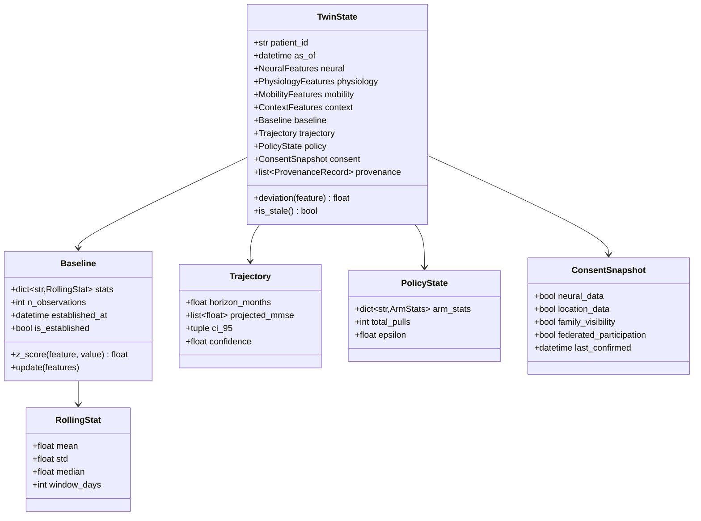
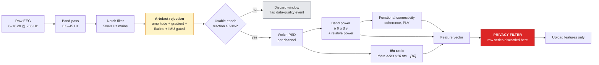
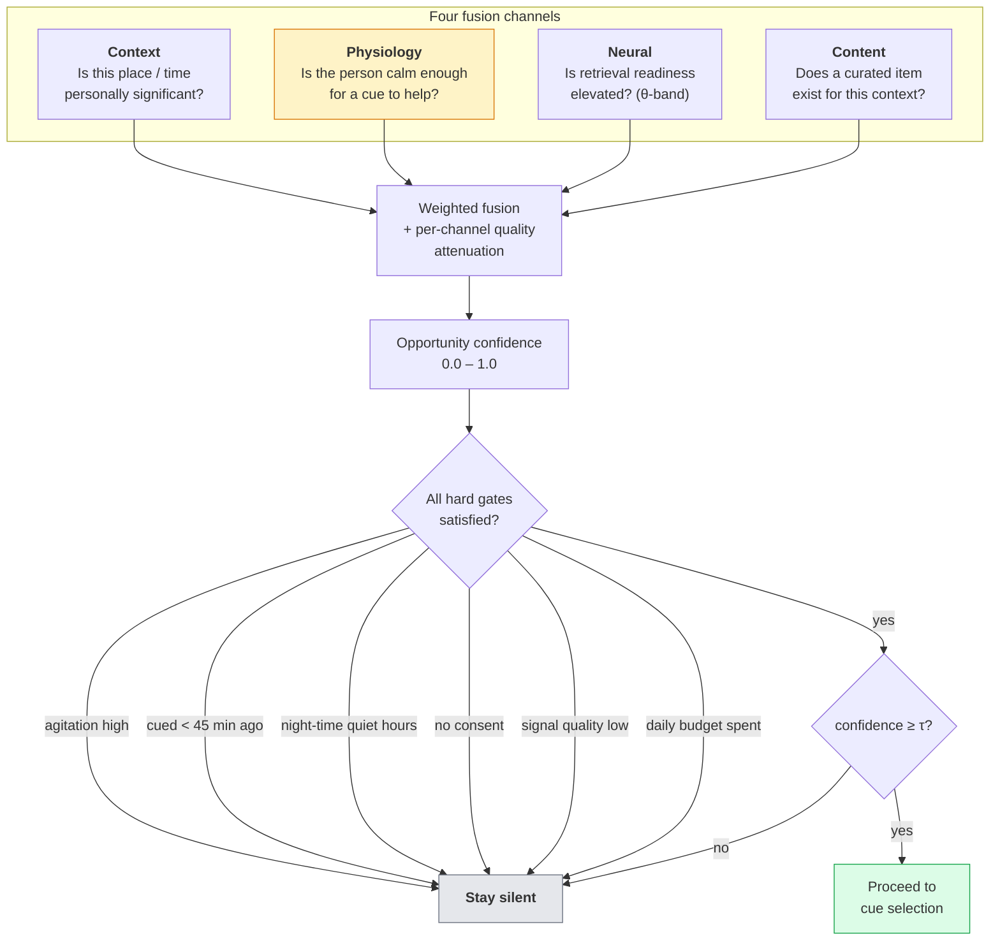
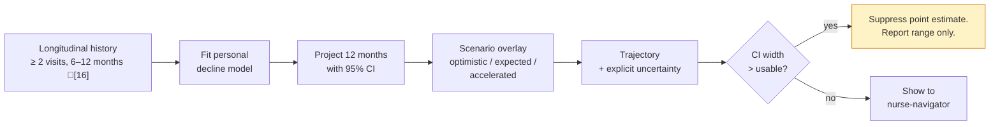
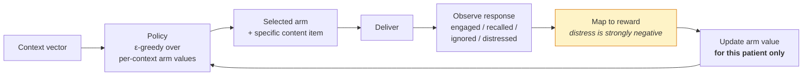
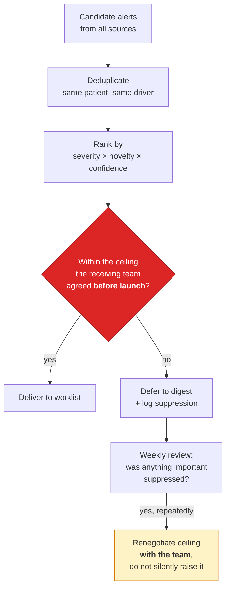
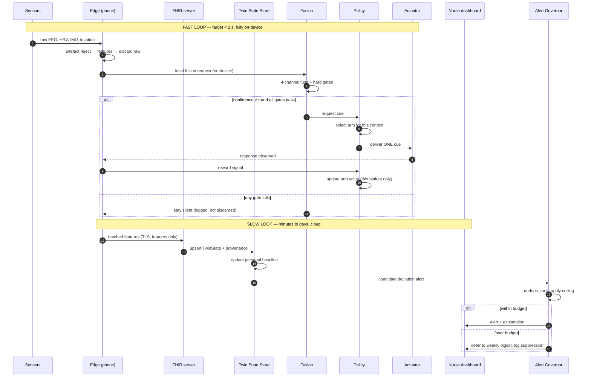

# 3. Digital Twin Engine (DTE)

> ⚠️ Reference architecture only. See [`../DISCLAIMER.md`](../DISCLAIMER.md).

The DTE is the core of the system: the service that maintains a **living, patient-specific model**
and answers questions against it. This document is the component-level design (C4 Level 3).

**Reference implementation:** [`../src/dte/`](../src/dte/)

---

## 3.0 What "Digital Twin" means here — and what it does not

The term is used loosely in the literature, so it is worth being precise.

**It is not** a 3-D anatomical rendering of a brain. **It is not** a biophysical simulation of
neuronal firing. **It is not** a full-fidelity replica of a person.

**It is** a continuously updated statistical state object for one individual, containing:

1. **Current state** — the person's latest derived features across four modalities.
2. **Personal baseline** — rolling distributional statistics of those same features, from this
   person's own history. This is what makes it a *twin* rather than a dashboard.
3. **Trajectory** — a forecast of where those features are heading.
4. **Learned preferences** — what has actually worked for this person, per context.
5. **Provenance** — how every value got there, and under what consent.

The distinction matters because it sets the fidelity bar. A twin defined this way can be built from
non-invasive sensors and validated against observable outcomes. A biophysical replica cannot, and
promising one is how this field loses credibility.

## 3.1 Twin State Store

The single source of truth for "how is this person, now, relative to themselves".

### Design rules

| Rule | Why |
|---|---|
| **Baseline is per-patient and never population-derived.** | Principle P1. A gait speed of 0.9 m/s is unremarkable for one person and alarming for another. |
| **Baseline requires `n ≥ 14` days before it is `is_established`.** | Before that, no deviation alert can fire. Firing alerts against an unestablished baseline is how monitoring pilots generate noise in week one and get abandoned in week six. |
| **Every write appends a `ProvenanceRecord`.** | Source device, ingestion time, transform version, consent basis. Required for audit ([§8.6](08-security-and-privacy.md#86-audit-and-provenance)). |
| **Reads are gated by `ConsentSnapshot`.** | If location consent is withdrawn, location features become unreadable — not merely hidden in the UI. |
| **State is append-only; the current view is a projection.** | You must be able to reconstruct what the twin looked like when a clinician acted on it. |
| **`is_stale()` is explicit.** | A twin that has not received data in 72 h must say so rather than silently serving old state. |

Schema: [`../schemas/json-schema/twin-state.schema.json`](../schemas/json-schema/twin-state.schema.json).
Implementation: [`../src/dte/twin.py`](../src/dte/twin.py).

## 3.2 Signal Processing Service

Runs at the **edge tier**, on the patient's phone. This is the only component that ever sees raw
neural time-series.

### Why artefact rejection is a first-class component

Ambulatory EEG signal quality degrades materially with patient movement and electrode placement
(🔵 LITERATURE [17]). A model validated on clean laboratory recordings and deployed against
ambulatory data is validated against the wrong distribution. Artefact correction is therefore a
**core requirement, not an optional preprocessing step** — and the quality gate (`≥60%` usable
epochs) is enforced *before* any inference, so the system prefers to say "I don't know" over
inferring from junk.

The IMU gate is a small but important detail: the wristband accelerometer tells the pipeline when the
person was moving, so motion-contaminated epochs can be excluded on independent evidence rather than
guessed at from the EEG alone.

### Feature set

| Modality | Features | Source |
|---|---|---|
| **Neural (EEG)** | Absolute + relative band power (δ 0.5–4, θ 4–8, α 8–13, β 13–30, γ 30–45 Hz); **θ/α ratio**; frontal–parietal coherence; phase-locking value; spectral entropy | 🔵 [2][3][16] |
| **Physiology** | RMSSD, SDNN, pNN50, LF/HF ratio, resting HR | 🔵 [22] |
| **Mobility** | Gait speed, stride-time variability, step count, sedentary fraction, night-time activity | 🔵 [15] |
| **Context** | Location semantics (home / known place / novel), time of day, day of week, recent cue history | R3 |

Implementation: [`../src/dte/signals/`](../src/dte/signals/).

## 3.3 Multimodal Fusion Service

Answers one question: **is this a genuine memory-retrieval opportunity, or a coincidence?**

Four channels, each with a distinct job. None is sufficient alone.

### The physiology channel is a veto, not a vote

This is the most important asymmetry in the fusion design. HRV serves as a rough proxy for
agitation. **Elevated agitation does not lower the confidence score — it blocks the cue outright.**

A cue delivered to an agitated person is not merely ineffective; it is likely to be actively
distressing and to teach the person to resent the device. The architecture treats "make it worse"
as a categorically different error from "miss an opportunity", and the hard gates encode that.

### Hard gates (all must pass)

| Gate | Default | Rationale |
|---|---|---|
| Agitation below threshold | HRV-derived index < 0.7 | A cue during agitation is counterproductive |
| Refractory period elapsed | ≥ 45 min since last cue | Prevents nagging |
| Quiet hours respected | Not 22:00–07:00 local | Sleep is protected |
| Consent active for this modality | — | P8 |
| Signal quality sufficient | ≥ 60% usable epochs | Do not infer from junk |
| Daily cue budget remaining | ≤ 8 cues/day, caregiver-configurable | Burden ceiling |

Implementation: [`../src/dte/fusion/detector.py`](../src/dte/fusion/detector.py).

## 3.4 Neurodegeneration Simulator

Projects a plausible cognitive trajectory forward, **against the person's own history**.

**Non-negotiable output rule:** the simulator never emits a point estimate without an interval. When
the interval is too wide to be actionable, it suppresses the point estimate entirely rather than
letting a clinician anchor on a number the model cannot support. Presenting a confident-looking
forecast built on two data points is how forecasting tools lose clinical trust permanently.

Implementation: [`../src/dte/models/decline.py`](../src/dte/models/decline.py).

## 3.5 Risk Stratification Service

Produces the R1 output: MCI-to-dementia conversion risk within an 18-month window.

- **Model:** ensemble of random forest + gradient-boosted trees. Ensembles have reached close to 88%
  accuracy in multimodal risk stratification (🔵 LITERATURE [4]), and no single algorithm wins every
  dementia-prediction task. See [ADR-0004](adr/0004-ensembles-over-deep-networks.md).
- **Output contract:** `risk_score` ∈ [0,1], `risk_band` ∈ {low, moderate, elevated},
  `top_features` (≥ 3, with direction and magnitude), `model_version`, `subgroup_gap_at_release`.
- **Cannot emit without:** passing the fairness gate ([§7.4](07-validation-and-benchmarks.md#74-the-subgroup-fairness-gate))
  and attaching explanations ([ADR-0006](adr/0006-explainability-as-a-hard-requirement.md)).

Implementation: [`../src/dte/models/risk.py`](../src/dte/models/risk.py).

## 3.6 Personalisation Policy Service

Chooses **which** cue to deliver once the fusion service has decided a cue *should* be delivered.

Framed as a **contextual multi-armed bandit**: arms are cue modalities (photo, voice recording,
ambient audio, scent), context is the fused feature vector, reward is observed patient response.

### Why a bandit and not a full RL agent

A full sequential RL formulation (SARSA, Q-learning) needs many episodes to converge and can take
harmful exploratory actions on the way. With a cognitively vulnerable person and a cue budget of
roughly eight per day, you do not have the episode count, and you cannot afford the exploration cost.
A contextual bandit converges faster, degrades gracefully, and is auditable — a clinician can be
shown exactly why arm 3 was chosen. See
[ADR-0008](adr/0008-contextual-bandit-for-cue-selection.md).

**Reward shaping is asymmetric by design:** a distress response carries a much larger negative
reward than an ignored cue carries. The policy is explicitly biased toward caution.

**Learning is per-patient.** Cross-patient priors may initialise a new patient's arm values, but
learned preferences are never pooled without federated aggregation and explicit consent.

Implementation: [`../src/dte/policy/cue_selector.py`](../src/dte/policy/cue_selector.py).

## 3.7 Alert Budget Governor

A small service with disproportionate importance. It sits between every alert-producing component and
every human.

The ceiling is a **negotiated contract with the receiving team**, recorded in configuration and
changeable only through the same conversation that set it. The suppression log exists so that
throttling is auditable — you must be able to answer "did we hide something that mattered?"

Implementation: `AlertBudget` in [`../src/dte/fusion/detector.py`](../src/dte/fusion/detector.py).

## 3.8 Explainability Service

Sits between every model and every clinician-facing surface. There is no bypass path.

| Output | Explanation attached |
|---|---|
| Risk score | Top 3+ contributing features, with direction, magnitude and plain-language gloss ("theta-band power elevated 1.8 SD above this patient's own baseline") |
| Deviation alert | Which feature deviated, by how much, over what window, versus which baseline |
| Trajectory | Which historical observations anchor the projection; explicit CI |
| Cue selection | Which context features drove arm choice; what has worked for this person before |

Clinician resistance to this class of tool is usually a **trust** problem, not a technology-literacy
problem — clinicians who can see why a model reached its conclusion adopt it at meaningfully higher
rates than clinicians handed an opaque score (🔵 LITERATURE [18]). That finding is why explainability
is architecturally structural here rather than a feature flag.

## 3.9 Component interaction — end-to-end sequence

Note step ordering in the fast loop: the cue is delivered **before** anything is uploaded. The cloud
is not on the critical path, so the memory loop keeps working on a train, in a basement, or with the
data plan switched off.

## 3.10 Failure modes and designed responses

| Failure | System response | Principle |
|---|---|---|
| EEG headset not worn / disconnected | Fast loop degrades to 3-channel fusion with raised threshold; twin marks neural features stale | Graceful degradation |
| Signal quality below 60% | No inference. Data-quality event logged, clinician sees "insufficient data", not a score | Never infer from junk |
| Baseline not yet established (< 14 days) | Deviation alerting disabled entirely | Avoid week-one noise |
| Cloud unreachable | Fast loop unaffected; features queue locally | Cloud off critical path |
| Consent withdrawn mid-session | Affected features become unreadable immediately; queued uploads for that modality are purged | P8 |
| Model drift detected | Model pinned to last-validated version; retraining triggered; clinician banner shown | [§6.7](06-ml-architecture.md#67-mlops-and-drift-monitoring) |
| Fairness gate fails at release | **Release blocked.** Previous model stays live | P4 |
| Alert volume exceeds ceiling | Governor defers and logs; does not silently raise the ceiling | P5 |
| Patient reports distress after a cue | Strong negative reward; modality suppressed for 24 h; caregiver notified | Do no harm |

## 3.11 Where to go next

- The fast loop in full detail: [§4 Memory Anchoring Pipeline](04-memory-anchoring-pipeline.md)
- Data contracts: [§5 Data Architecture](05-data-architecture.md)
- Model training and validation: [§6 ML Architecture](06-ml-architecture.md)
