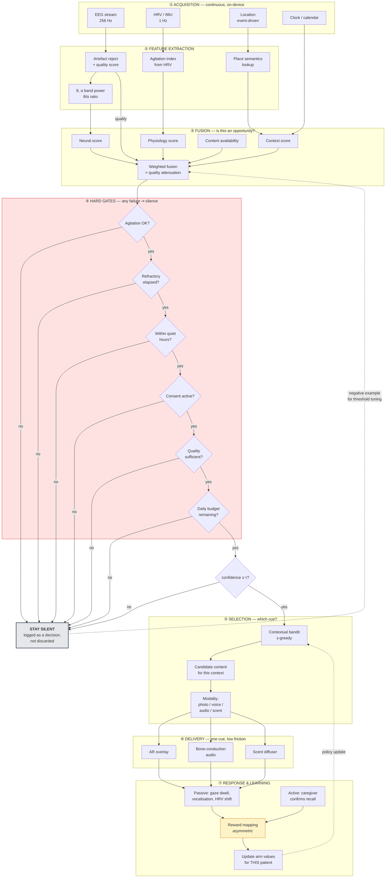
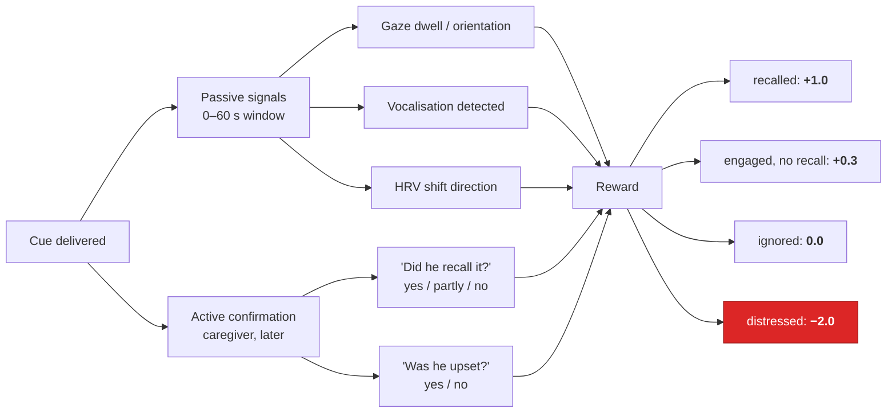

# 4. Memory Anchoring Pipeline (MAP)

> ⚠️ Reference architecture only. See [`../DISCLAIMER.md`](../DISCLAIMER.md).

The MAP is the patient-facing core of the system and the part with the least precedent, so it is
specified in the most detail. It implements requirement
[R3](02-requirements-and-traceability.md#25-requirement-r3--patient-facing-cognitive-engagement-and-memory-support).

**Reference implementation:** [`../src/dte/fusion/detector.py`](../src/dte/fusion/detector.py),
[`../src/dte/policy/cue_selector.py`](../src/dte/policy/cue_selector.py)
**Try it:** `make demo`

---

> ### ⚠️ The MAP is a Tier 3 capability
>
> Everything in this document requires **fidelity tier T3** — neural sensing present and reporting
> ([§15](15-fidelity-ladder.md), [ADR-0010](adr/0010-tiered-fidelity-ladder.md)).
>
> Below T3, `OpportunityDetector.decide()` returns **silent**. It does not fall back to a
> context-only or physiology-only cue. That would be a different intervention with a different
> risk profile, delivered under the name of one that had been evaluated.
>
> Two consequences worth stating plainly. First, the MAP is the novel contribution of this work
> **and** the part with the least supporting evidence and no route to reimbursement
> ([ADR-0011](adr/0011-non-neural-core.md)). Second, the therapeutic premise it inherits —
> reminiscence therapy — has a Cochrane evidence base showing small, inconsistent benefits and a
> *potential carer-anxiety harm* at long-term follow-up. Carer anxiety is therefore a
> release-gating safety endpoint ([§7.5a](07-validation-and-benchmarks.md#75a-r4--caregiver-benchmarks-minimum-tier-t0)).

## 4.1 The idea in one scenario

A man in his seventies, recently diagnosed with early Alzheimer's, is out for a walk with his
daughter. He passes a courtyard. Fifty years ago he proposed to his wife there.

He does not remember. But the raw material for remembering is still in there, and it is closer to the
surface right now than it will be an hour from now — he is in the right place, he is calm, and his
EEG shows the theta-band elevation associated with memory-retrieval readiness (🔵 LITERATURE [2]).

His daughter, months ago, uploaded a photograph from that day and a thirty-second voice recording of
her mother. The system has been waiting for exactly this configuration of circumstances.

His glasses show the photograph. Nothing else. No notification stack, no menu, no chime.

Then the system does the part that actually matters: it records whether anything happened. Did he
look at it? Did he say something? Did his daughter later confirm he recalled the day? Or did he
ignore it — or worse, find it upsetting? That answer is used to refine what works **for him
specifically**, not for patients in general.

## 4.2 Why this is hard

Four failure modes, each of which has killed a real product in this space:

| Failure mode | Why it happens | How MAP addresses it |
|---|---|---|
| **Nagging** | The system cues too often, so the person stops attending to it. | Refractory period, daily budget, and a policy whose default action is silence. |
| **Cueing into distress** | A cue arrives while the person is agitated, making things worse and teaching them to resent the device. | Physiology channel is a **hard veto**, not a weighted vote. |
| **Generic content** | Stock imagery and generic prompts do not cue episodic memory. Personalised content outperforms generic (🔵 [25]). | Content Library is caregiver-curated per patient; no generic fallback. |
| **No feedback loop** | The system never learns whether it worked, so it never improves. | Response capture is mandatory; an undelivered outcome is treated as missing data, not as success. |

The architectural consequence of all four: **MAP is precision-weighted, not recall-weighted.** It is
designed to miss opportunities rather than to fire wrongly. A missed cue costs one moment. A wrong
cue costs trust, and trust does not come back.

## 4.3 Full pipeline



Note that **silence is a first-class outcome with its own log entry.** It is not an absence of
behaviour. Recording *why* the system stayed quiet is what makes threshold tuning possible and what
lets a clinician answer a family's question: "why didn't it do anything on Tuesday?"

## 4.4 The four fusion channels

### Channel 1 — Context: is this place or moment personally significant?

| Input | Meaning |
|---|---|
| Place class | `home` / `known-significant` / `known-routine` / `novel` |
| Significance weight | Caregiver-assigned, 0–1, per tagged place |
| Time of day | Circadian effects on cognition are real; late-afternoon confusion is common |
| Recency | Has this place already been cued today? |

`known-significant` places are those a caregiver has explicitly tagged and linked to content. A novel
place scores *low*, not high — novelty is disorienting, and this system is not a tour guide.

### Channel 2 — Physiology: is the person calm enough for a cue to help?

An agitation index is derived from HRV (reduced RMSSD, elevated LF/HF) combined with movement
irregularity from the IMU.

**This channel is a veto.** See [§3.3](03-digital-twin-engine.md#the-physiology-channel-is-a-veto-not-a-vote).
HRV is an imperfect agitation proxy, which is exactly why it is used conservatively: false-positive
agitation costs a missed cue, while false-negative agitation costs a distressed person.

### Channel 3 — Neural: is retrieval readiness elevated?

Theta-band (4–8 Hz) power relative to **this person's own baseline**, plus the θ/α ratio. Theta-band
power keeps showing up as unusually informative in this literature, adding roughly ten points of
accuracy when included (🔵 LITERATURE [16]), and theta activity is associated with memory-retrieval
readiness (🔵 LITERATURE [2]).

**Honest caveat, stated in the architecture rather than hidden:** the inference from "theta is
elevated relative to baseline" to "this person is receptive to a cue right now" is the least
well-evidenced link in this entire system. It is plausible and literature-supported at the group
level; it is not established at the single-trial, single-person level. This is the first thing a real
validation study should attack. See [§7.6](07-validation-and-benchmarks.md#76-the-weakest-link).

### Channel 4 — Content: does something curated exist for this moment?

Not a scoring channel so much as a precondition. If the caregiver has curated nothing relevant, there
is nothing to deliver, and the system stays silent. **There is no generic fallback content.** A stock
photograph of a beach does not cue an episodic memory; it just interrupts a walk.

### Fusion arithmetic

```
raw_confidence = w_ctx·s_ctx + w_neu·s_neu + w_cnt·s_cnt     # physiology excluded — it vetoes
attenuation    = min(signal_quality / GOOD_QUALITY, 1.0)     # GOOD_QUALITY = 0.85
confidence     = raw_confidence × attenuation
deliver        = all(hard_gates) and confidence ≥ τ
```

Note that attenuation is measured against a **"good enough" reference of 0.85, not against a
perfect 1.0.** This is not a detail. Signal quality is *already* subject to a hard gate at 0.60, so
multiplying the score by raw quality as well would penalise it twice — a recording of perfectly
acceptable quality (0.82) would silently raise the effective threshold from 0.62 to 0.76, and the
pipeline would become unable to fire under any realistic combination of channel scores. That is a
miscalibration masquerading as caution, and it was caught by a test asserting that a simulated day
delivers at least one cue.

Default weights (`w_ctx=0.35`, `w_neu=0.40`, `w_cnt=0.25`) and `τ=0.62` are **starting points for
calibration, not tuned values.** They are configuration, and the calibration procedure is in
[§7.5](07-validation-and-benchmarks.md#75-calibrating-the-map-threshold).

## 4.5 Cue delivery

One cue. One modality. No stacking.

| Modality | Hardware | Best for | Constraint |
|---|---|---|---|
| **Photograph** | AR glasses or phone | Places, faces, events | Requires the person to be looking; unsuitable while crossing a road |
| **Voice recording** | Bone-conduction headphones | Relationships, familiar voices | Highest-impact and highest-risk: a deceased spouse's voice needs explicit caregiver and clinical sign-off |
| **Ambient audio** | Same | Era, mood, place atmosphere | Subtle; low measurable response |
| **Scent** | Wearable micro-diffuser | Strong episodic association via olfactory–hippocampal pathway | Slow onset, hard to target, hardware immature |

### Delivery safety rules

1. **Motion lockout.** No visual cue while gait indicates active walking near a road boundary.
2. **One at a time.** Never two modalities simultaneously; that is stimulation, not a cue.
3. **Dismissible without interaction.** A cue that requires a button press to clear is a demand, not
   an offer.
4. **Sensitive-content sign-off.** Content involving deceased people, or anything a caregiver marks
   sensitive, requires clinical sign-off before it enters the eligible pool.
5. **Patient stop.** A single spoken or gestural "stop" suspends all cueing for 24 hours, no
   confirmation dialog.

Rule 5 is the operational form of the ethical position in
[§10](10-governance-and-ethics.md): the person is a participant with standing to refuse, not a
monitored object.

## 4.6 Response capture and reward



The **−2.0 versus +1.0** asymmetry is the single most important number in the MAP. It encodes the
clinical judgement that upsetting someone is worse than failing to help them. A policy learned with a
symmetric reward will, given a noisy signal, drift toward firing more often. This one drifts toward
silence.

Active confirmation is optional and low-friction — one question in the caregiver app, skippable. An
unanswered confirmation is recorded as **missing**, never imputed as success. Systems that impute
missing feedback as positive learn to fire constantly.

## 4.7 Worked trace 🟡 ILLUSTRATIVE

Synthetic output from `make demo` — no real patient involved.

```
[14:02:11] place=known-routine(0.31) θ/α=1.02(z=+0.2) agit=0.22 content=none
           confidence=0.19 → SILENT (below threshold, no content)

[14:47:03] place=known-significant(0.88) θ/α=1.61(z=+1.8) agit=0.24 content=3 items
           gates: agitation ✓ refractory ✓ hours ✓ consent ✓ quality ✓(0.82) budget ✓(3/8)
           confidence=0.79 ≥ τ=0.62 → DELIVER
           arm=photo (value 0.71, n=14 | voice 0.66 n=9 | scent 0.31 n=4)
           content=courtyard_1974.jpg  latency=1.4s
           response: gaze_dwell=4.2s vocalisation=yes → reward=+0.3 (pending caregiver confirm)

[15:03:55] place=known-significant(0.88) θ/α=1.58(z=+1.7) agit=0.26 content=2 items
           confidence=0.77 ≥ τ → but REFRACTORY 16m < 45m → SILENT

[19:40:12] place=home(0.40) θ/α=1.71(z=+2.1) agit=0.81 content=5 items
           confidence=0.74 ≥ τ → but AGITATION VETO (0.81 > 0.70) → SILENT
           note: highest neural score of the day, correctly suppressed
```

The last entry is the design working as intended. The strongest neural signal of the day was
suppressed because the person was agitated. A recall-weighted system would have fired there and made
the evening worse.

## 4.8 Where to go next

- Data model for cues and responses: [§5](05-data-architecture.md)
- How the bandit is trained and evaluated: [§6](06-ml-architecture.md)
- How τ is calibrated and what must be proven before home use: [§7](07-validation-and-benchmarks.md)
- The consent and dignity framework this depends on: [§10](10-governance-and-ethics.md)
