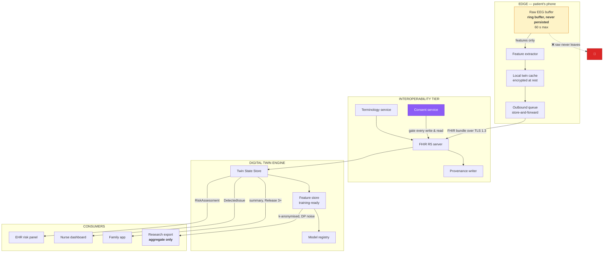
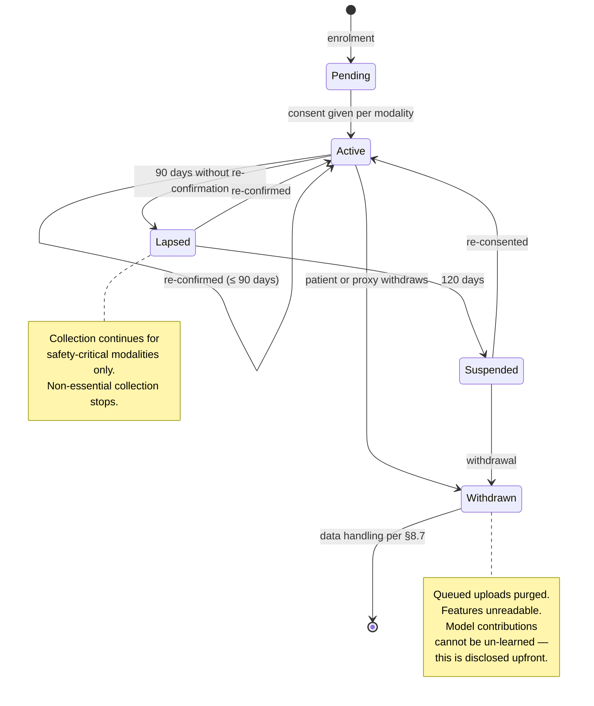

# 5. Data Architecture

> ⚠️ Reference architecture only. **This repository contains no real patient data and must never
> contain any.** See [`../DISCLAIMER.md`](../DISCLAIMER.md).

**Schemas:** [`../schemas/fhir/`](../schemas/fhir/) · [`../schemas/json-schema/`](../schemas/json-schema/)

---

## 5.1 The core decision: FHIR R5 as the canonical model

EEG, wearable and EHR data rarely arrive speaking the same format. Organisations that delay investing
in standards-based integration tend to discover the real cost of that delay only on their second or
third use case, not their first (🔵 LITERATURE [6]).

So: **every piece of clinical data that crosses the interoperability tier is an HL7 FHIR R5 resource.**
No bespoke internal formats leave the edge tier. Full rationale and rejected alternatives in
[ADR-0001](adr/0001-fhir-r5-canonical-model.md).

The practical test of this decision: adding a fourth requirement later should require *zero* new
integration work at the data layer. If it does not, the decision was implemented wrongly.

## 5.2 Resource mapping

| Domain concept | FHIR R5 resource | Profile / code | Example file |
|---|---|---|---|
| EEG band-power feature | `Observation` | LOINC-coded panel, component per band | [`eeg-band-power.json`](../schemas/fhir/eeg-band-power.json) |
| EEG data quality | `Observation` | Quality score + usable-epoch fraction | [`eeg-band-power.json`](../schemas/fhir/eeg-band-power.json) |
| Heart-rate variability | `Observation` | LOINC 80404-7 (RMSSD) + components | [`hrv-observation.json`](../schemas/fhir/hrv-observation.json) |
| Gait / mobility | `Observation` | Gait speed, stride variability | [`gait-observation.json`](../schemas/fhir/gait-observation.json) |
| Cognitive assessment | `Observation` | LOINC 72106-8 (MoCA), 72172-0 (MMSE) | [`cognitive-assessment.json`](../schemas/fhir/cognitive-assessment.json) |
| **MCI→dementia risk score** | `RiskAssessment` | Custom prediction, **with `basis` populated** | [`risk-assessment.json`](../schemas/fhir/risk-assessment.json) |
| Baseline deviation alert | `DetectedIssue` | Severity + `evidence.detail` | [`detected-issue-deviation.json`](../schemas/fhir/detected-issue-deviation.json) |
| **Memory cue delivered** | `Procedure` | Non-clinical intervention, modality-coded | [`cue-delivery-procedure.json`](../schemas/fhir/cue-delivery-procedure.json) |
| Cue response | `Observation` | Linked via `partOf` to the Procedure | [`cue-delivery-procedure.json`](../schemas/fhir/cue-delivery-procedure.json) |
| Caregiver burden | `Observation` | Validated instrument score | [`caregiver-burden.json`](../schemas/fhir/caregiver-burden.json) |
| **Consent** | `Consent` | Per-modality provisions, revocable | [`consent.json`](../schemas/fhir/consent.json) |
| Sensor device | `Device` | Identifier, firmware version | [`device.json`](../schemas/fhir/device.json) |
| Patient | `Patient` | Pseudonymised identifier only | [`patient.json`](../schemas/fhir/patient.json) |

### Two mapping decisions worth explaining

**Risk output is a `RiskAssessment`, not an `Observation`.** `RiskAssessment` has a `basis` field
designed to hold the evidence a prediction rests on. That is exactly where the explainability payload
belongs, which means explainability travels with the score through any FHIR-conformant system rather
than living only in our own UI. If the score is exported, the reasons go with it.

**A memory cue is a `Procedure`.** It is an intervention performed on a patient with an intended
therapeutic effect, and it needs to appear in the record as something that *happened to* them. Modelling
it as a lesser resource type would make it invisible to audit, which for an intervention delivered
autonomously to a cognitively vulnerable person is unacceptable.

## 5.3 Data flows

### Flow rules

| Rule | Enforcement |
|---|---|
| Raw EEG lives in a **60-second ring buffer** and is never written to disk | Edge tier design; no persistence API exists for it |
| Features are uploaded in batches, not per-sample | Reduces attack surface and battery cost |
| Every write is consent-gated **at the server**, not only in the client | Consent service sits in front of the FHIR server |
| Every write generates a `Provenance` resource | Provenance writer is not bypassable |
| Research export is aggregate-only, k-anonymised, with differential-privacy noise | Separate pipeline; no patient-level export path exists |
| Retention: features 7 years (clinical record), cue logs 2 years, raw 0 | [§8.7](08-security-and-privacy.md#87-retention-and-deletion) |

## 5.4 Consent-gated flows

Consent is not a checkbox at enrolment. It is **per-modality, continuously re-confirmed, and
revocable without penalty**.

**The uncomfortable honesty in that last note matters.** Once a patient's data has contributed to a
trained model, withdrawal cannot remove that contribution retroactively without full retraining. The
architecture does not pretend otherwise. The consent language says so in plain terms, and the
federated design ([ADR-0003](adr/0003-federated-learning-over-central-pooling.md)) limits how much
any single person contributes. Claiming a right to erasure the system cannot deliver would be worse
than disclosing the limit.

## 5.5 The internal twin state document

FHIR is the *exchange* format. Inside the DTE, the twin is a single JSON document validated against
[`twin-state.schema.json`](../schemas/json-schema/twin-state.schema.json).

Why both: FHIR is verbose and normalised for interoperability, which makes it a poor fit for a
low-latency read of "give me this person's current state and baseline". The twin document is a
denormalised projection, rebuilt from FHIR resources, and FHIR remains the system of record. If the
twin document is lost it can be fully reconstructed; if the FHIR store is lost, the record is gone.

## 5.6 The personal content library

The most sensitive data in the system, and the least technical.

| Field | Purpose |
|---|---|
| `content_id` | Stable reference |
| `media_type` | photo / voice / ambient-audio / scent-profile |
| `curator` | Which caregiver added it, and when |
| `linked_places` | Place tags where this item is eligible |
| `linked_people` | Who appears in it |
| `era` | Approximate life period — supports era-matched cueing |
| `sensitivity` | `routine` / `sensitive` / `requires-clinical-signoff` |
| `signoff` | Clinician who approved, if required |
| `suppressed_until` | Set automatically after a distress response |

### Governance rules

1. **Only a named caregiver can add content.** No automated ingestion from a photo library. The act
   of choosing is the point.
2. **Content involving a deceased person is `requires-clinical-signoff` by default.** A spouse's
   recorded voice can be the most powerful cue available and the most harmful.
3. **The patient can remove any item**, at any time, without justification, and without the caregiver
   being notified — because the alternative makes removal socially costly.
4. **Content is stored encrypted and never leaves the institution's boundary.** It is not training
   data. It is not exported. It is not included in federated updates.
5. **Distress triggers automatic suppression** of the item and its modality for 24 hours, and flags it
   for caregiver review.

Rule 3 is the one most likely to be argued about in implementation. It is deliberate: a person living
with dementia retains the right to decide what is shown to them, and a system that reports every
removal to a family member converts that right into a negotiation.

## 5.7 Data quality contract

Nothing enters the twin without a quality assessment attached.

| Signal | Quality metric | Minimum to use |
|---|---|---|
| EEG | Usable-epoch fraction after artefact rejection | ≥ 0.60 |
| EEG | Channel count reporting valid data | ≥ 6 of 8 |
| HRV | Beat-detection confidence | ≥ 0.80 |
| Gait | Contiguous walking bout length | ≥ 30 s |
| Location | Horizontal accuracy | ≤ 25 m |
| Cognitive score | Administered by a trained assessor | boolean, required |

Below minimum, the feature is marked `insufficient` and **excluded from inference** — it is not
imputed. The clinician-facing surface shows "insufficient data" rather than a score built on a guess.
Imputing missing physiological data in a monitoring system is how a confident-looking dashboard ends
up describing a patient who was not wearing the device.

## 5.8 Where to go next

- How this data is turned into models: [§6 ML Architecture](06-ml-architecture.md)
- How it is protected: [§8 Security & Privacy](08-security-and-privacy.md)
- Concrete resource examples: [`../schemas/fhir/`](../schemas/fhir/)
