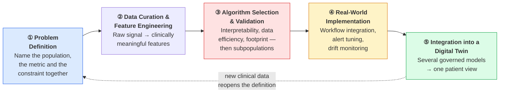
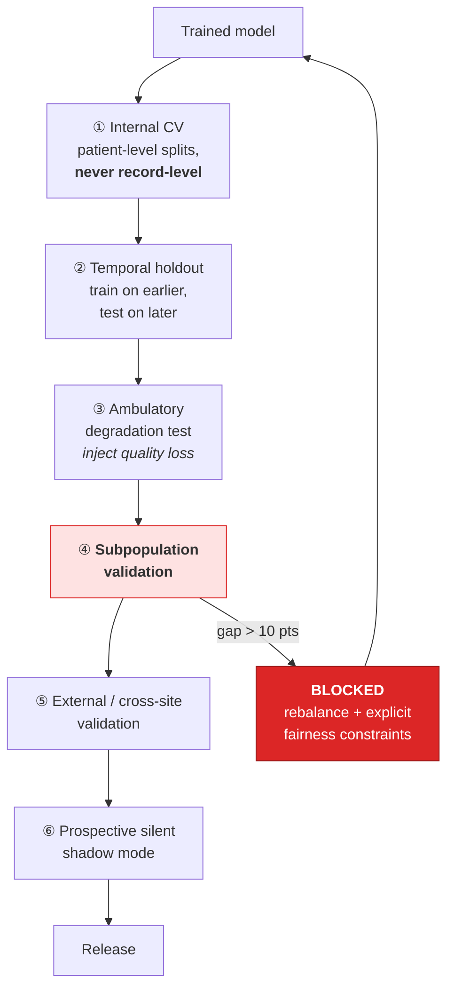
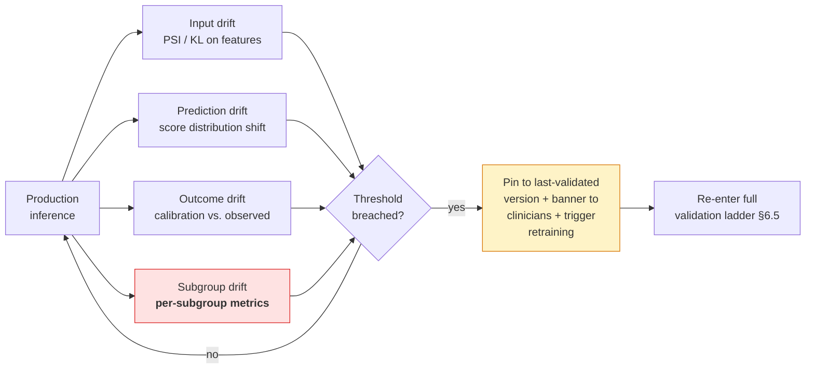
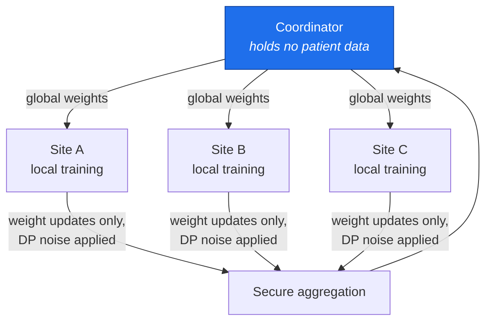

# 6. ML Architecture

> ⚠️ Reference architecture only. Models in this repository are trained on **synthetic data**. Their
> accuracy reflects the generator's assumptions, not biology. See [`../DISCLAIMER.md`](../DISCLAIMER.md).

**Reference implementation:** [`../src/dte/models/`](../src/dte/models/) ·
[`../src/dte/fairness/`](../src/dte/fairness/)

---

## 6.1 The five-stage methodology

The whole ML architecture is an implementation of one disciplined process. Its durability comes from
not depending on any particular model staying state-of-the-art.

**The two stages that get skipped are ③'s subpopulation check and ④'s workflow integration.** Skipping
either produces a system that performs beautifully in a demonstration and gets quietly abandoned six
months into deployment. Both are therefore enforced structurally in this architecture — the fairness
gate can block a release, and the alert governor sits in the delivery path.

## 6.2 Stage 1 — Problem definition

Vague goals cannot be engineered against. "Improve dementia diagnosis" tells a data-science team
nothing.

A workable definition names three things together. For R3:

> Detect, in real time, moments when a patient with mild-to-moderate Alzheimer's is likely receptive
> to a personalised memory cue, and deliver that cue through a non-invasive channel, with improvement
> in recall confirmed by the patient or caregiver afterward.

| Sharpening question | Answer for R3 |
|---|---|
| **Who exactly has this problem?** | CDR 0.5–1.0. Earlier, support is not needed; later, it is not reliable. |
| **What is "good enough to deploy", numerically?** | Comparable AI-EEG systems for transition prediction land near **81%** accuracy against roughly **73%** for conventional CSF analysis (🔵 [16]). Not a perfect benchmark for a different task, but a useful anchor for "meaningfully better than the status quo". |
| **What is genuinely off the table?** | Non-invasive EEG, yes (🔵 [2]). Frequent invasive sampling, no — regardless of paper performance, because nobody will submit to it repeatedly. |

That third question is where most projects quietly cheat, by keeping a technically superior option on
the table that will never survive contact with a real patient.

## 6.3 Stage 2 — Data curation and feature engineering

### Three sources, used together

| Source | Strength | Weakness |
|---|---|---|
| Accumulated institutional records | Volume, real-world messiness | Retrospective, inconsistent coding |
| Multi-institutional collaboration under genuine governance | Scale and diversity — almost no single institution has enough patients to train something robust (🔵 [5]) | Governance overhead; harmonisation cost |
| Prospective collection | Highest quality, purpose-built | Slow; trades short-term speed for long-term quality |

Across all three, the evidence points the same way: **6–12 months of longitudinal follow-up materially
outperforms a single visit** (🔵 [16]). Longitudinality is a data-architecture requirement, not a
nice-to-have.

### Raw signal does not go into a model

An EEG recording with millions of data points per patient becomes spectral power across delta, theta,
alpha, beta and gamma bands, plus functional connectivity between regions (🔵 [2][3]). Theta-band
power adds roughly **ten points** of accuracy when included (🔵 [16]).

This is the stage where a neurologist's judgement and an ML engineer's tooling have to sit in the same
room. Neither discipline gets it right alone: the engineer will engineer features that are
statistically productive and physiologically meaningless, and the neurologist will propose features
that are meaningful and unobtainable from a dry-electrode consumer headset.

Implementation: [`../src/dte/signals/eeg.py`](../src/dte/signals/eeg.py).

## 6.4 Stage 3 — Model selection

### Selection criteria, ranked

| Criterion | Why it can outrank raw accuracy |
|---|---|
| **Interpretability** | A clinician who cannot see why a model reached its conclusion will not act on it. Explainable approaches have repeatedly improved clinician trust in this exact setting (🔵 [18]). |
| **Data efficiency** | Most healthcare organisations have nowhere near a research lab's volume of labelled data. |
| **Computational footprint** | A model needing a GPU cluster is simply not an option for many community health systems. |
| Accuracy | Necessary, not sufficient. |

### Chosen models

| Task | Model | Rationale |
|---|---|---|
| MCI→dementia risk (R1) | **Ensemble: random forest + gradient-boosted trees**, soft-voted | No single algorithm wins every dementia-prediction task; ensembles have reached close to **88%** accuracy in multimodal risk stratification (🔵 [4]). Native feature importances give explainability for free. |
| Cognitive trajectory (R1/R2) | **Per-patient linear mixed-effects / robust regression with explicit CI** | Interpretable, works with very few observations, and honest about uncertainty. |
| Baseline deviation (R2) | **Rolling robust z-score with CUSUM change detection** | Not machine learning at all, and that is the point. A statistical method the nurse-navigator can understand and challenge beats a black box for this task. |
| Cue selection (R3) | **Contextual bandit, ε-greedy** | Converges in the small number of episodes available; auditable arm-by-arm ([ADR-0008](adr/0008-contextual-bandit-for-cue-selection.md)). |

Deep networks are deliberately not used. Full reasoning in
[ADR-0004](adr/0004-ensembles-over-deep-networks.md).

The R2 choice deserves emphasis: **using no machine learning where statistics suffice is an
architectural decision, not a shortfall.** It reduces the explainability burden, the drift surface and
the compute footprint simultaneously.

## 6.5 Validation as its own discipline

Validation is not a final checkbox before launch.

| Step | Guards against |
|---|---|
| Patient-level CV splits | Leakage — the same patient's two visits landing in train and test, which inflates accuracy dramatically |
| Temporal holdout | Learning artefacts of a specific era of clinical practice |
| **Ambulatory degradation test** | Validating on clean lab EEG and deploying on motion-contaminated ambulatory EEG (🔵 [17]) |
| **Subpopulation validation** | Accuracy documented falling to around **70%** in under-represented groups when training data does not reflect them (🔵 [19]) |
| Cross-site validation | Site-specific idiosyncrasies masquerading as biology |
| Silent shadow mode | Discovering workflow problems after clinicians are already relying on it |

The subpopulation gap closes through **deliberate rebalancing and explicit fairness constraints**, not
through hoping it resolves once the dataset gets bigger (🔵 [13]). Datasets getting bigger has not
historically closed these gaps.

## 6.6 Stage 4 — Real-world implementation

The stage research teams most reliably underestimate.

| Concern | Requirement |
|---|---|
| **Workflow integration** | Output reaches the clinician inside tools they already use, not behind a separate login nobody opens. AI decision tools succeed when clinicians help design them from the start through real iterative feedback, rather than receiving a finished product and being told to adopt it (🔵 [20]). |
| **Alert tuning** | A system calibrated without regard for real-world alert volume gets ignored regardless of underlying accuracy. Alerting logic tuned on one group and applied unmodified to a more diverse one produces documented efficacy losses (🔵 [14]). |
| **Recurring training** | Clinician training in interpreting *this system's specific outputs*, repeated — not a one-time go-live session. |
| **Feedback loop** | Clinical experience flows back into the model, or the system quietly drifts out of usefulness once launch excitement fades. |

## 6.7 MLOps and drift monitoring

**Subgroup drift is monitored separately from aggregate drift.** A model can hold steady in aggregate
while degrading badly for one group; an aggregate-only monitor will not see it. This is the runtime
counterpart of the release-time fairness gate.

On drift detection the system **pins to the last validated model version** rather than auto-promoting
a retrained one. Automatic promotion in a clinical system means an unvalidated model reaching a
patient.

### Model registry contract

Every registered model carries: training data snapshot ID, feature schema version, full validation
report including per-subgroup metrics, `max_subgroup_gap` at release, calibration curve, intended
population, known limitations, and a named accountable owner. A model without a named owner cannot be
promoted.

## 6.8 Federated learning

Almost no single institution has enough patients to train something robust on its own (🔵 [5]), and
centralising raw neural data across institutions is both a privacy problem and, in many
jurisdictions, a legal one.

**Status: documented, not implemented.** The reference code contains no federated learning. This is
stated plainly because a diagram in a repository is frequently mistaken for working software. See
[ADR-0003](adr/0003-federated-learning-over-central-pooling.md) and
[`../DISCLAIMER.md`](../DISCLAIMER.md#5-known-limitations-of-the-reference-implementation).

## 6.9 Stage 5 — Integration into a Digital Twin

Stages ①–④ describe building **one** well-governed model for **one** well-defined problem. Stage ⑤ is
combining several into a continuously updated, patient-specific twin that fuses BCI, wearable and
clinical-record signals into one coherent view supporting diagnosis, monitoring and personalised
intervention together (🔵 [22]).

The ordering constraint is the important part: **integrate toward a unified patient view only once the
individual pieces have earned trust.** Building the unified twin first, then trying to validate its
components retroactively, is the failure pattern this staging exists to prevent.

## 6.10 What Chapter 2's case studies taught this architecture

| Case study | Stage it validates | Lesson encoded here |
|---|---|---|
| NYU Caregiver Intervention | ① | Named a precise population and a **validated** outcome measure (caregiver depressive symptoms on a real scale) rather than "supporting caregivers". |
| Care Ecosystem (28 health systems) | ④ | Built from day one to sit inside existing care-coordination roles, not to require a new role nobody had budgeted for (🔵 [7][20]). → [ADR-0005](adr/0005-additive-not-replacement-workflow.md) |
| ADQueryAid | ③ | Usability tested **head-to-head against a generic chatbot**, not assessed alone. → comparative evaluation in [§7](07-validation-and-benchmarks.md) |
| HAAL | ②+④ | Co-design workshops with caregivers *and* clinicians: data requirements and workflow built with the people who would use the system. |
| CogniHelp | ⑤ | Personalisation advantage over generic alternatives — tie content to one patient's actual history. → [§5.6](05-data-architecture.md#56-the-personal-content-library) |
| EEG biomarker research | ①+② | Source of much of the Stage ① and ② evidence in the first place. |

## 6.11 Where to go next

- The exact numeric gates: [§7 Validation & Benchmarks](07-validation-and-benchmarks.md)
- Runnable models: [`../src/dte/models/`](../src/dte/models/)
