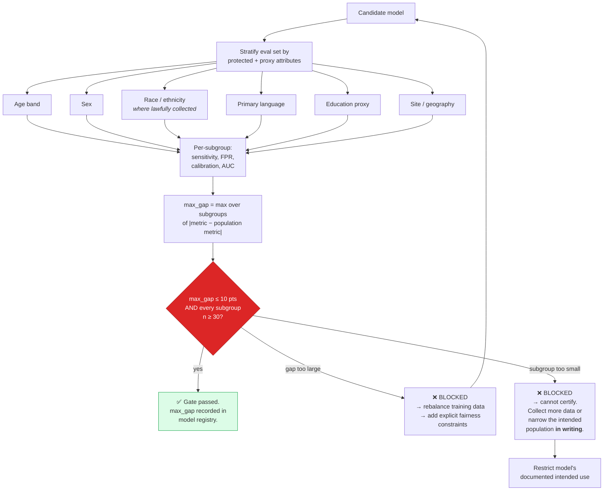
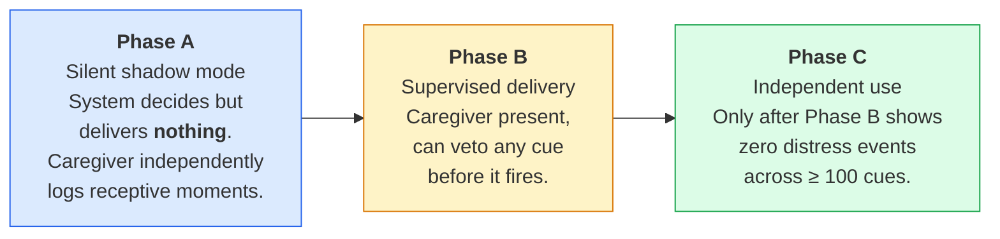

# 7. Validation and Benchmarks

> ⚠️ **Every number in this document is a 🟡 TARGET the system would have to hit before deployment.
> None is a measurement. Nothing here has been tested on a real cohort.** See
> [`../DISCLAIMER.md`](../DISCLAIMER.md).

This is the document that answers question **Q3** of the six-question gate — *what number would tell
us it's working?* — for every requirement.

---

## 7.1 Why benchmarks are pre-registered

A benchmark chosen after seeing the results is not a benchmark. Every threshold below is fixed before
a release cycle begins, recorded in configuration, and changeable only through a documented decision
with a named owner.

This matters more here than in most software because the failure mode is silent: a model that misses
its target gets shipped anyway with a softer framing, and nobody can point to the moment the standard
slipped.

## 7.1a Benchmarks are indexed by tier

Every benchmark below states the **minimum fidelity tier** at which it applies. A twin operating
below that tier does not fail the benchmark — the benchmark does not apply to it, because the
capability it measures is not available ([§15](15-fidelity-ladder.md), [ADR-0010](adr/0010-tiered-fidelity-ladder.md)).

| Family | Minimum tier | What it measures |
|---|---|---|
| **B1.x** | **T2** — wristband physiology | Conversion-risk identification |
| **B2.x** | **T1** — smartphone ambient | Baseline-deviation monitoring |
| **B3.x** | **T3** — neural | Memory Anchoring Pipeline |
| **B4.x** | **T0** — caregiver report | Caregiver outcomes |

Note the asymmetry, because it is the point of the whole ladder: **the caregiver benchmarks apply
from T0**. A twin with nothing but a caregiver questionnaire can still move caregiver burden, and
that is the configuration reaching the ~71% of people with dementia projected to live in
low- and middle-income countries by 2050.

The fairness gate (§7.4) must hold **at each tier independently**, not only in aggregate. A model
certified at T3 is not thereby certified at T1. This is not yet implemented and is the most likely
source of a future correctness defect.

## 7.2 R1 — Risk identification benchmarks *(minimum tier: T2)*

| ID | Benchmark | 🟡 Target | Failure consequence | Rationale |
|---|---|---|---|---|
| **B1.1** | Sensitivity, MCI→dementia conversion, 18-month window | **≥ 80%** | Release blocked | Missing a converter is the costly error — it becomes an avoidable emergency visit or an unplanned placement |
| **B1.2** | False-positive rate | **≤ 20%** (≤ 1 in 5 flagged patients not progressing) | Release blocked | Above this, clinicians stop trusting the flag and the tool becomes shelfware |
| **B1.3** | Max subgroup accuracy gap vs. population | **≤ 10 pts** | **Release blocked, no exceptions** | A design choice argued in [ADR-0007](adr/0007-subgroup-fairness-gate.md). The earlier citation for a specific percentage loss could not be verified and was removed |
| **B1.4** | Calibration (Brier score) | **≤ 0.18** | Warning + review | A miscalibrated 70% means nothing to a clinician |
| **B1.5** | Explanation coverage | **100%** of scores carry ≥ 3 ranked features | Release blocked | P3 — a score without a reason gets ignored (🔵 [18]) |
| **B1.6** | Ambulatory degradation tolerance | ≤ 5 pt accuracy loss under injected 15% signal-quality loss | Warning + review | Ambulatory recording degrades with motion and electrode placement; the specific percentage previously cited could not be verified |

**Anchor for "meaningfully better than status quo":** comparable AI-EEG systems for transition
prediction land near **81%** accuracy against roughly **73%** for conventional CSF analysis
(🔵 LITERATURE [16]). Ensembles have reached close to **88%** in multimodal risk stratification
(🔵 LITERATURE [4]). These are other people's results on related tasks — useful as an anchor, not as a
promise.

## 7.3 R2 — Monitoring benchmarks *(minimum tier: T1)*

| ID | Benchmark | 🟡 Target | Failure consequence |
|---|---|---|---|
| **B2.1** | Time to detect clinically meaningful baseline deviation | **≤ 48 hours** | Release blocked |
| **B2.2** | Weekly alert volume per nurse-navigator caseload | **≤ ceiling the receiving team signed off before launch** | Release blocked |
| **B2.3** | Alert precision (acted-on / total) | **≥ 60%** | Warning + ceiling renegotiation |
| **B2.4** | Baseline establishment period | ≥ 14 days before any alert can fire | Enforced in code |
| **B2.5** | Suppression audit | 0 suppressed alerts that retrospective review deems clinically significant | Warning + ceiling renegotiation |

### B2.2 is the benchmark most likely to be quietly dropped

It is not a model metric, so it does not appear on an accuracy slide, and it is the one that has
actually killed monitoring pilots. 🟡 A prior pilot was abandoned after six weeks — not because the
model was wrong, but because nobody had checked whether the alert volume was survivable for the humans
receiving it.

The ceiling is set by the **receiving team**, before launch, in writing. It is not a target the
engineering team picks. Raising it requires the same conversation that set it. See
[§3.7](03-digital-twin-engine.md#37-alert-budget-governor).

## 7.4 The subgroup fairness gate

The only gate in this architecture with unconditional release-blocking authority.

### Three rules that make the gate real rather than decorative

1. **It runs automatically in CI, not as a manual review step.** A gate a human has to remember to run
   is a gate that gets skipped under deadline pressure.
2. **"Not enough data to check" blocks the release too.** The alternative — shipping uncertified and
   assuming it is fine — is how gaps reach production. If a subgroup cannot be certified, the
   *documented intended population* must be narrowed to exclude it, in writing, so the limitation is
   visible to every clinician using the tool.
3. **The gap closes through rebalancing and explicit fairness constraints**, not through waiting for a
   bigger dataset (🔵 LITERATURE [13]). Accuracy has been documented falling to around **70%** in
   under-represented groups (🔵 LITERATURE [19]); scale alone has not historically fixed that.

Implementation: [`../src/dte/fairness/subgroup.py`](../src/dte/fairness/subgroup.py). Test:
[`../tests/test_fairness.py`](../tests/test_fairness.py).

## 7.5 Calibrating the MAP threshold

R3's threshold τ cannot be set from a literature value. It must be calibrated, and the calibration is
deliberately asymmetric.

| ID | Benchmark | 🟡 Target |
|---|---|---|
| **B3.1** | Cue latency, signal to delivery | **< 2 s**, p95 |
| **B3.2** | **Distress rate** | **≤ 1%** of delivered cues — the binding constraint |
| **B3.3** | Engagement rate (any observed response) | ≥ 40% |
| **B3.4** | Caregiver-confirmed recall improvement | ≥ 25% of engaged cues |
| **B3.5** | Precision of opportunity detection vs. caregiver-logged ground truth | ≥ 65% |
| **B3.6** | Recall of opportunity detection | **No minimum.** Deliberately unconstrained. |

**B3.6 is the point.** There is no recall target. The system is permitted — encouraged — to miss
opportunities. Setting a recall target would push τ down and increase firing, trading distress for
coverage. That trade is refused.

**τ is tuned to satisfy B3.2 first**, then B3.5, then everything else. If satisfying B3.2 pushes
engagement below B3.3, the honest conclusion is that the neural signal is not yet good enough for
independent use — not that B3.2 should be relaxed.

## 7.5a R4 — Caregiver benchmarks *(minimum tier: T0)*

Added by [ADR-0012](adr/0012-caregiver-outcomes-as-primary.md). These are **primary** endpoints,
not secondary ones, on three grounds set out in that ADR: the best-evidenced intervention in
dementia care works *through* the caregiver; caregiver depression is associated with a 73% increase
in emergency department use; and the Cochrane review of reminiscence therapy — the therapeutic
premise the MAP inherits — found no carer benefit and a potential carer-anxiety harm.

| ID | Benchmark | Instrument | Blocks release? |
|---|---|---|---|
| **B4.1** | Caregiver burden | Zarit Burden Interview, 12-item | ✅ |
| **B4.2** | Caregiver depressive symptoms | PHQ-9 | ✅ |
| **B4.3** | Time to institutionalisation | Days to first permanent placement | ✅ |
| **B4.4** | **Carer anxiety at long-term follow-up** | GAD-7 at ≥ 6 months | ✅ **safety endpoint** |
| B4.5 | Informal care hours | Self-reported weekly hours | ⚠️ Descriptive only |

### B4.4 is a safety endpoint, not a benefit

The other four ask whether the system helps. B4.4 asks whether it harms, and it is treated the way
the subgroup fairness gate is treated: **a deterioration in carer anxiety at long-term follow-up
blocks release of the MAP, regardless of how every patient-facing metric performs.**

The reason is specific rather than precautionary. The Cochrane review of reminiscence therapy
(🔵 LITERATURE: 22 studies, n=1,972; meta-analysis of 16, n=1,749) found small and inconsistent benefits to
quality of life, cognition and communication — and, on carer outcomes, *no evidence of benefit
together with a potential adverse outcome: carer anxiety at longer-term follow-up*. The Memory
Anchoring Pipeline is built on that therapeutic premise. Building it without measuring the one harm
its own evidence base flags would not be defensible.

B4.5 is descriptive rather than gating because it is self-reported and highly variable. It is
retained because it is the measure that translates most directly into the economic case in
Chapter 4.

### What this cannot measure

A dyad with no identifiable primary caregiver cannot be evaluated on B4.1–B4.4. That population is
real, is frequently at the highest risk, and this benchmark set does not solve for it.

## 7.6 The weakest link

Stated explicitly, because a reference architecture that hides its own weakest assumption is not
useful.

**The inference from "theta-band power is elevated relative to this person's baseline" to "this person
is receptive to a memory cue right now" is the least well-evidenced link in the system.**

It is plausible. It is literature-supported at the group level — theta activity is associated with
memory-retrieval readiness (🔵 [2]), and theta-band features add roughly ten points of accuracy in
related prediction tasks (🔵 [16]). It is **not** established at the single-trial, single-person,
real-time level, which is exactly what the MAP relies on.

### This is no longer a caveat — it is the architecture

When this section was first written, it recorded a weakness and changed nothing upstream. It now
drives the design. Because the neural channel is the least-evidenced component, it sits in an
**optional tier that must earn its cost** rather than in the spine
([ADR-0011](adr/0011-non-neural-core.md)).

Two published findings forced that, and neither concerns adherence — at-home EEG adherence in mild
Alzheimer's dementia has been reported at ~77% over 52 weeks, against ~55% typical for at-home
monitoring in older populations. People will wear it.

* Resting-state EEG classifiers reach ~AUC 0.85 separating Alzheimer's disease from controls, and
  **~AUC 0.60 for mild cognitive impairment** — closer to chance than to clinical utility, in the
  population R1 exists to serve (Meghdadi et al., 2021, *PLoS ONE* 16(2):e0244180).
* A systematic review of 172 articles covering 234 experiments found that **cognitive assessment
  outperformed imaging** for progression prediction, that nearly a quarter of studies had test-set
  problems inflating reported accuracy, and that short-horizon predictions may be no better than
  predicting the person stays stable (Ansart et al., 2020, *Medical Image Analysis* 67:101848).

The practical consequence: if the ablation below returns a negative result, **T3 is removed from
the ladder**. That is a change to one table rather than a rewrite of the architecture, which is why
the ladder was worth building.

### What a real study should do to it

| Test | Design |
|---|---|
| **Ablation** | Run the MAP with the neural channel disabled (context + content only). If detection precision does not degrade meaningfully, the EEG headset is adding cost, burden and privacy risk for nothing — and should be dropped. |
| **Sham control** | Deliver cues at times matched for context but *not* for neural state. If outcomes are equivalent, the neural channel is not doing the work. |
| **Within-person reliability** | Does theta elevation predict the same person's receptiveness consistently across weeks, or is it noise that happens to correlate once? |

**The ablation is the single most valuable experiment anyone could run against this architecture.** It
is cheap, it is decisive, and a negative result would simplify the entire system. Anyone forking this
work is invited to run it and open an issue with the result — including, especially, a negative one.

## 7.7 Release gate summary

A release proceeds only if all of the following hold.

| Gate | Blocks release? |
|---|---|
| B1.1 sensitivity ≥ 80% | ✅ Yes |
| B1.2 FPR ≤ 20% | ✅ Yes |
| **B1.3 subgroup gap ≤ 10 pts** | ✅ **Yes, unconditionally** |
| B1.5 explanation coverage 100% | ✅ Yes |
| B2.1 deviation detected ≤ 48 h | ✅ Yes |
| **B2.2 alert volume ≤ agreed ceiling** | ✅ **Yes** |
| B3.1 cue latency < 2 s p95 | ✅ Yes |
| **B3.2 distress rate ≤ 1%** | ✅ **Yes** |
| **B4.1 caregiver burden (Zarit)** | ✅ **Yes** |
| **B4.2 caregiver depression (PHQ-9)** | ✅ **Yes** |
| **B4.3 time to institutionalisation** | ✅ **Yes** |
| **B4.4 carer anxiety not worsened at ≥6 months** | ✅ **Yes — blocks MAP release specifically** |
| **Claim ceiling respected: no output above its tier** | ✅ **Yes — enforced in code, `tests/test_tiers.py`** |
| Every subgroup has n ≥ 30, or population narrowed in writing | ✅ Yes |
| Named accountable owner recorded for every model | ✅ Yes |
| B1.4, B1.6, B2.3, B2.5, B3.3–B3.5, B4.5 | ⚠️ Warning + documented review |

## 7.8 Where to go next

- Phase-by-phase go / no-go criteria: [§11 Implementation Roadmap](11-implementation-roadmap.md)
- Who has authority to block, and who signs off: [§10 Governance](10-governance-and-ethics.md)
