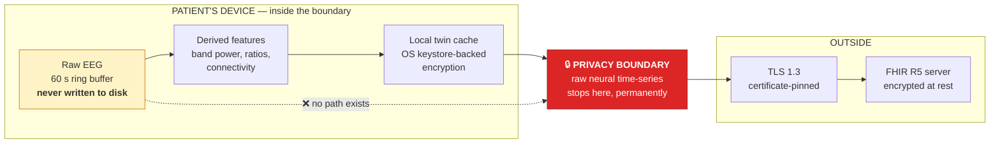

# 8. Security and Privacy

> ⚠️ **The reference implementation in this repository implements NO authentication and NO encryption.
> It is a local demonstration only and must never be exposed to a network.** This document describes
> what a real deployment requires. See [`../DISCLAIMER.md`](../DISCLAIMER.md).

---

## 8.1 Why neural data needs its own treatment

Neural data is not just another health signal, for three reasons that matter architecturally:

1. **It is highly identifying.** EEG has person-discriminative properties comparable to a biometric.
   "De-identified EEG" is a weaker guarantee than it sounds.
2. **It may reveal more than intended.** Signals collected to assess memory-retrieval readiness can
   carry information about mood, attention and cognitive load that nobody consented to share.
3. **The people it is collected from have, by definition, fluctuating capacity to consent.** The
   population this system serves is the population least able to police its own privacy.

Point 3 drives the entire consent architecture in [§8.5](#85-consent-architecture). The other two
drive the edge-first design.

## 8.2 The privacy boundary

The most consequential line in the architecture.

**Enforced by absence, not by policy.** There is no API, no debug flag and no support-mode override
that uploads raw EEG. If a feature is later needed that requires raw signal — a new artefact algorithm,
say — it must be implemented on-device or the requirement must be dropped. A policy that says "we don't
upload raw data" is one urgent bug-fix away from being false. Removing the capability is not.

Full reasoning and rejected alternatives:
[ADR-0002](adr/0002-edge-first-neural-processing.md).

## 8.3 Threat model

| # | Threat | Impact | Mitigation |
|---|---|---|---|
| T1 | Device theft or loss | Local twin cache exposed | OS keystore encryption; remote wipe; 60 s raw buffer means almost nothing recoverable |
| T2 | Network interception | Feature stream exposed | TLS 1.3, certificate pinning, no plaintext fallback |
| T3 | Server compromise | Bulk feature and content-library exposure | Encryption at rest with separate key custody; content library in a distinct encryption domain; least-privilege service accounts |
| T4 | **Re-identification from "anonymised" features** | Patient identified from EEG signature | Aggregate-only research export; k-anonymity ≥ 5; differential-privacy noise; **no patient-level export path exists** |
| T5 | Model inversion / membership inference | Training-set membership leaked | DP noise on federated updates; no raw gradients shared; secure aggregation |
| T6 | **Insider misuse** — staff browsing a patient's cue history out of curiosity | Dignity violation; loss of trust | Every read is audit-logged and attributable; access is role-scoped and time-bounded; periodic access review |
| T7 | **Coerced consent by a family member** | Patient monitored against their own wishes | Patient stop-command overrides caregiver settings; withdrawal requires no justification; content removal is not reported to caregivers ([§5.6](05-data-architecture.md#governance-rules) rule 3) |
| T8 | Malicious cue injection | Distress or manipulation of a vulnerable person | Content library is write-restricted to named caregivers; sensitive content requires clinical sign-off; delivery is rate-limited and fully logged |
| T9 | Sensor spoofing | False alerts, wasted clinical attention | Device identity attestation; physiological plausibility checks |
| T10 | Alert-log inference by third parties | Insurance or employment discrimination | Risk scores are not exported outside the treating institution; no third-party API |

**T6 and T7 are the threats most often left out of a health-AI threat model**, because they are not
technical attacks — they are misuse by people who are legitimately inside the system. For this
population they are the most likely harms to actually occur.

## 8.4 Controls by tier

| Tier | Controls |
|---|---|
| **Sensing** | Device attestation; paired-only Bluetooth; firmware version recorded in `Device` resource |
| **Edge** | OS keystore encryption; no raw persistence; biometric unlock; remote wipe; certificate pinning |
| **Interop** | OAuth 2.0 + SMART on FHIR scopes; consent service in front of every read and write; input validation against FHIR profiles |
| **DTE** | Least-privilege service accounts; secrets in a managed vault; network segmentation; no direct database access from experience tier |
| **Federated** | Secure aggregation; differential privacy; coordinator holds no patient data |
| **Experience** | Role-based access; session timeout; no PHI in URLs, logs or analytics |
| **Cross-cutting** | Append-only audit log; automated dependency scanning; annual penetration test; documented incident response |

## 8.5 Consent architecture

Consent here is **per-modality, time-bounded, continuously re-confirmed and revocable without
penalty** — modelled as a FHIR `Consent` resource with a provision per data category
([`consent.json`](../schemas/fhir/consent.json)).

| Modality | Default | Re-confirm | Notes |
|---|---|---|---|
| EEG / neural | **Opt-in** | 90 days | Never on by default |
| Wearable HRV / gait | Opt-in | 90 days | |
| **Location / geofence** | **Opt-in, off by default** | 30 days | Shortest cycle — highest surveillance potential |
| Memory cue delivery | Opt-in | 90 days | Patient stop-command overrides instantly |
| Family visibility | Opt-in | 90 days | Patient can restrict what family sees |
| Federated participation | Opt-in | Annual | Separately consented from clinical use |
| Research use | **Separate opt-in** | Annual | Never bundled with care consent |

### Capacity and proxy consent

The hard problem. The architecture's position:

1. **Assume capacity unless formally assessed otherwise.** Diminished capacity for a complex financial
   decision does not imply inability to decide about a photograph.
2. **Proxy consent covers collection, never the stop-command.** A proxy can enrol a patient. A proxy
   cannot override the patient's refusal of a cue in the moment.
3. **Assent is required even where consent is proxied.** If the person shows behavioural refusal, that
   is dispositive regardless of paperwork.
4. **Re-assess capacity on a documented schedule**, and record which basis each `Consent` provision
   rests on.
5. **Withdrawal never requires justification** and never triggers a clinical escalation.

Rule 2 is the one that gives this section teeth. Without it, "consent" for this population collapses
into a family member's decision.

## 8.6 Audit and provenance

Every state change in the twin generates an immutable record: **who or what wrote it, when, from which
device, under which consent provision, using which transform version.**

Every *read* of patient-identifiable data is logged with the accessing identity and purpose. That
covers T6, and it is also what allows the system to answer a family's question — "who has looked at
this?" — truthfully.

The audit log is append-only and stored separately from the operational database, so compromising the
application does not let an attacker rewrite history.

## 8.7 Retention and deletion

| Data | Retention | On withdrawal |
|---|---|---|
| Raw EEG | **Never persisted** (60 s buffer) | n/a |
| Derived features | 7 years (clinical record obligation) | Marked withdrawn; excluded from all processing; retained only as required by law |
| Twin state snapshots | 7 years | As above |
| Cue delivery + response logs | 2 years | Deleted unless part of an adverse-event record |
| **Personal content library** | Until withdrawn | **Deleted immediately and irreversibly** |
| Audit log | 7 years | Retained — deleting an audit trail defeats its purpose |
| Federated model contributions | Baked into weights | **Cannot be removed without full retraining — disclosed at consent** |

The last row is disclosed at consent time in plain language rather than glossed over. Promising a
right to erasure the architecture cannot deliver would be a worse failure than acknowledging the limit.

## 8.8 Regulatory posture

This is a reference architecture, not a regulatory strategy — but the design choices below exist to
make a real pathway feasible rather than to claim compliance.

| Framework | Design implication |
|---|---|
| **HIPAA** (US) | PHI encrypted in transit and at rest; audit controls; minimum necessary access; BAAs required with any processor |
| **GDPR** (EU) | Neural + health data are special-category (Art. 9): explicit consent, DPIA required, data minimisation via edge processing, Art. 22 satisfied by keeping a human in every decision loop |
| **EU AI Act** | A dementia risk-stratification tool is likely **high-risk**: requires risk management, data governance, technical documentation, logging, human oversight, accuracy and robustness testing. This documentation set is structured to feed that file. |
| **FDA / SaMD** | Risk-scoring likely Class II software as a medical device. **No clearance has been sought or obtained.** |
| **India DPDP Act 2023** | Consent notice requirements; data-principal rights; relevant given the LMIC deployment context the source book emphasises |

Nothing in this repository should be read as evidence of compliance with any of the above.

## 8.9 What the reference code does *not* do

Stated as a list so it cannot be missed:

- ❌ No authentication or authorisation on the API
- ❌ No TLS (plain HTTP on localhost)
- ❌ No encryption at rest
- ❌ No audit logging
- ❌ No consent enforcement (the consent model is defined in schema, not enforced in code)
- ❌ No federated learning
- ❌ No differential privacy

**Do not deploy this code.** It exists to make the architecture concrete and testable, and every one
of the above would need building before any real data touched it.

## 8.10 Where to go next

- Accountability and ethics: [§10 Governance & Ethics](10-governance-and-ethics.md)
- Deployment topology: [§9 Deployment Architecture](09-deployment-architecture.md)
