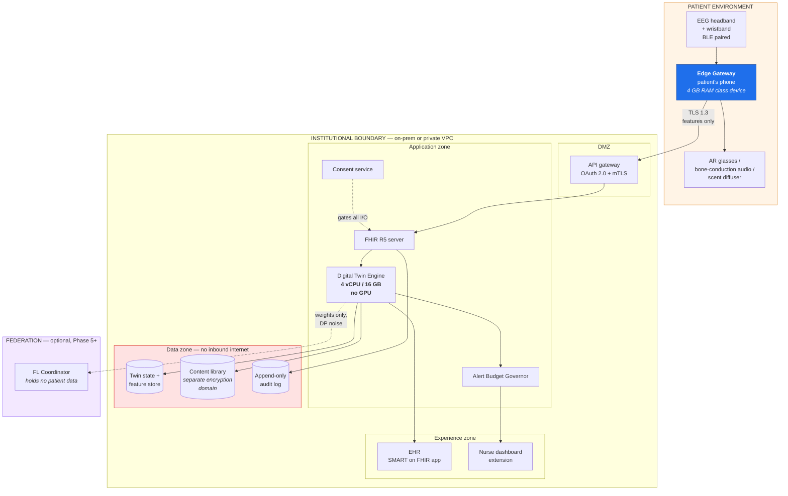

# 9. Deployment Architecture

> ⚠️ Reference architecture only. See [`../DISCLAIMER.md`](../DISCLAIMER.md).

---

## 9.1 The governing decision: additive, not replacement

The single highest-leverage decision a team makes is whether a new AI system is positioned as an
**addition** to existing clinical workflow or a **replacement** for it.

In healthcare, addition wins almost every time — even when a clean replacement would, on paper, be more
efficient. Clinical staff cannot absorb a brand-new system while also being expected to keep patients
safe that same week.

Concretely:

| Component | Additive placement | The replacement version that was rejected |
|---|---|---|
| EEG risk score | Lives inside the **existing EHR risk panel**, beside cardiovascular and fall-risk scores clinicians already trust | A standalone "dementia AI" web app with its own login |
| Deviation alerts | **Extend** the nurse-navigator's existing dashboard | A second dashboard to check |
| Governance | **Add AI-specific review criteria** to existing clinical-quality and technology-investment committees | Stand up a new AI oversight committee from nothing |

The governance row matters as much as the technical ones. Existing committees already have
institutional authority and, more importantly, clinician trust. A new committee has neither and takes
two years to acquire them.

Full reasoning: [ADR-0005](adr/0005-additive-not-replacement-workflow.md).

## 9.1a Cost envelope by fidelity tier

Deployment cost is dominated by the fidelity tier, not by the server topology.

| Fidelity tier | Per-patient hardware | Recurring staffing burden | Reimbursement fit |
|---|---|---|---|
| **T0** | None | Existing clinical workflow | CPT 99483 |
| **T1** | Household smartphone | Minimal | GUIDE DCMP; chronic care management |
| **T2** | + consumer wristband | Device support, replacement, charging adherence | GUIDE DCMP at higher complexity; RTM codes |
| **T3** | + EEG headband | **Substantial** — in published at-home EEG work, 49% of participants with dementia required technology support versus 17% of controls | **None** |

That staffing row is the real cost driver at T3, not the headband. It is a per-patient-per-month
staffing line, and there is no billing code that funds it. Detailed economics: Chapter 4 of the
source book.

## 9.2 Topology

### Why the DTE sits inside the institutional boundary

Not in a vendor cloud. Three reasons:

1. Neural and cognitive data is special-category under GDPR and equivalent regimes; keeping it inside
   the controller's boundary removes an entire class of transfer problem.
2. The compute footprint is deliberately small enough ([ADR-0004](adr/0004-ensembles-over-deep-networks.md))
   that on-premise is affordable. This is a design constraint chosen *to enable* this deployment
   option, not a coincidence.
3. It makes the federated tier optional. An institution can run the whole system alone and join a
   federation later — or never.

## 9.3 Edge tier

| Property | Requirement | Why |
|---|---|---|
| Device class | 4 GB RAM, mid-range phone from the last 4 years | If it needs a flagship, the population that most needs this cannot use it |
| Offline capability | **Full fast-loop function with no connectivity** | The memory loop must work on a train, in a basement, or with data switched off |
| Battery target | ≤ 12% additional daily drain | A device the patient stops charging is a device that does not exist |
| Storage | 60 s raw ring buffer; ≤ 500 MB feature queue | Bounded by design |
| Sync | Opportunistic on Wi-Fi; cellular fallback for alerts only | Cost-aware — matters in LMIC contexts |

The offline requirement is architectural, not aspirational: the cloud is deliberately kept off the
fast loop's critical path ([§3.9](03-digital-twin-engine.md#39-component-interaction--end-to-end-sequence)).

## 9.4 Experience tier deployment

| Surface | Deployment | Release phase |
|---|---|---|
| Clinician risk view | SMART on FHIR app launched from within the EHR patient context | R1 Release 1 |
| EHR risk panel entry | Native panel item beside existing risk scores | R1 Release 3 |
| Nurse-navigator alerts | Extension to the existing care-coordination dashboard | R2 Release 2 |
| Family summary app | Standalone mobile app | **R2 Release 3 only** |
| Patient cue delivery | On-device; no UI beyond the cue itself | R3 Phase B |

**The family app being last is deliberate**, not a resourcing artefact. Showing a family a noisy,
untuned signal early produces anxiety rather than reassurance.

## 9.5 Three infrastructure decisions that are easy to underestimate

They do not feel urgent during planning, which is exactly the problem.

### 1. Data interoperability

EEG, wearable and EHR data rarely arrive speaking the same format. Organisations that delay investing
in standards-based integration tend to discover the real cost only on their **second or third** use
case, not their first (🔵 LITERATURE [6]).

→ FHIR R5 from day one, even though it is more work for use case #1.
([ADR-0001](adr/0001-fhir-r5-canonical-model.md))

### 2. Computational footprint

Processing at the edge — on-device or at the point of care — rather than routing every signal to a
centralised cloud cuts latency and shrinks the volume of sensitive neural data that ever needs to
travel anywhere. That makes the privacy conversation considerably easier.

→ Edge-first ([ADR-0002](adr/0002-edge-first-neural-processing.md)); cloud tier sized for a modest
server.

### 3. Scale economics

A system validated on a few dozen patients in one clinic faces a genuinely different cost and
governance profile once it covers tens of thousands across a health system.

| Dimension | 50 patients, 1 clinic | 20,000 patients, 1 health system |
|---|---|---|
| Alert triage | Informal | Requires the Alert Budget Governor, or the team drowns |
| Model governance | One model, one owner | Model registry, versioning, staged rollout, drift monitoring |
| Consent management | Paper-trackable | Requires an automated consent service with re-confirmation cycles |
| Fairness | Subgroups too small to certify | Subgroups large enough that gaps become measurable — and legally material |
| Support | The project team | A named operational owner and a runbook |
| Cost driver | Hardware per patient | Storage, integration maintenance, and clinician time |

Organisations that plan for that jump from the outset — rather than treating it as next year's problem
— are the ones whose pilots become permanent programmes instead of quietly expiring.

**Architectural consequence:** the Alert Budget Governor, model registry and consent service all exist
in the Phase 1 design even though a 50-patient pilot does not strictly need them. Retrofitting them at
5,000 patients means rewriting the delivery path under load.

## 9.6 Environments

| Environment | Data | Purpose |
|---|---|---|
| `local` | Synthetic only (`src/dte/data/synthetic.py`) | Development. What this repository runs. |
| `validation` | De-identified retrospective, under IRB | Model training and the validation ladder ([§6.5](06-ml-architecture.md#65-validation-as-its-own-discipline)) |
| `shadow` | Live data, **no output reaches any human** | Silent prospective validation |
| `production` | Live | Staged by release phase |

**Shadow mode is not optional.** It is the only environment where the system meets real data,
real signal quality and real alert volumes without a clinician's decision depending on it.

## 9.7 Operational readiness

Before any production phase:

- [ ] Named operational owner and escalation path
- [ ] Runbook for sensor failure, model drift, alert flood, consent-service outage
- [ ] Alert ceiling agreed **in writing** with the receiving team ([§7.3](07-validation-and-benchmarks.md#73-r2--monitoring-benchmarks))
- [ ] Rollback plan tested, including reverting an EHR panel change
- [ ] Clinician training delivered — and scheduled to **recur**, not one-time
- [ ] Patient-facing materials reviewed by the patient-and-family advisory council
- [ ] Incident response plan covering a device loss and a distress event
- [ ] Data protection impact assessment completed
- [ ] Fairness gate results published to the clinical-quality committee

## 9.8 Where to go next

- Phase sequencing and go / no-go: [§11 Implementation Roadmap](11-implementation-roadmap.md)
- Who signs off on each item above: [§10 Governance](10-governance-and-ethics.md)
