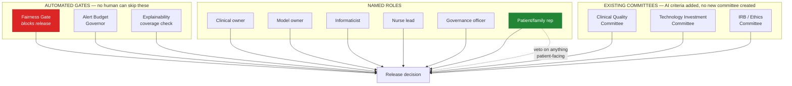

# 10. Governance and Ethics

> ⚠️ Reference architecture only. See [`../DISCLAIMER.md`](../DISCLAIMER.md).
>
> **This document is written to be read without a technical background.** If you are a person living
> with a diagnosis, a family caregiver, or a clinician, this is the document to read.

---

## 10.1 The position this architecture takes

Dementia care technology slides easily into surveillance. It happens without anyone deciding to do it:
each individual feature is reasonable, each one adds a little more monitoring, and the cumulative
result is a person whose day is observed continuously by a system that never asks them anything.

This architecture takes an explicit position against that:

> **The person living with dementia is a participant with standing to refuse, not a monitored object.**

That sentence is not decoration. It has concrete architectural consequences, and each is testable:

| Position | Mechanism | Where |
|---|---|---|
| The person can say stop, and stop means stop | Spoken or gestural stop suspends all cueing for 24 h, **no confirmation dialog**, and overrides caregiver settings | [§4.5](04-memory-anchoring-pipeline.md#delivery-safety-rules) rule 5 |
| The person can remove content without it becoming a family negotiation | Content removal is **not reported to the caregiver** | [§5.6](05-data-architecture.md#governance-rules) rule 3 |
| A proxy can enrol, but cannot override a refusal | Proxy consent covers collection only | [§8.5](08-security-and-privacy.md#capacity-and-proxy-consent) rule 2 |
| Location tracking is never assumed | Opt-in, off by default, 30-day re-confirmation — the shortest cycle in the system | [§8.5](08-security-and-privacy.md#85-consent-architecture) |
| Every feature must benefit the person, not only the institution | Design principle P7, enforced at the requirement gate | [§2](02-requirements-and-traceability.md) |
| Doing nothing is the safe default | Both loops fail toward silence | [§1.6](01-architecture-overview.md#16-the-two-decision-loops) |

If you fork this work, please carry that position with it.

## 10.2 Named accountability

"The vendor owns it" is not accountability. Six named roles, per requirement:

| Role | Owns | Can block |
|---|---|---|
| **Neurologist / geriatrician** | The clinical outcome | Clinical release |
| **Data scientist with EEG signal-processing expertise** (not a generalist) | Model development and validation | Model promotion |
| **Clinical informaticist** | EHR integration | Integration release |
| **Nurse-navigator lead** | Care-coordination workflow **and the alert ceiling** | Any change raising alert volume |
| **Data-governance officer** | Consent, privacy, retention, audit | Any new data collection |
| **Patient-and-family advisory representative** | Patient-facing experience | **Effective veto on anything patient-facing** |

### The advisory representative's veto is the load-bearing one

It is also the one most likely to be quietly weakened in a real organisation, because it is the only
role held by someone without institutional power.

Two protections: the veto applies to *anything patient-facing*, not to a review committee's agenda; and
the plain-language patient materials are **developed jointly** with the advisory council rather than
written by the team and shown to them. Nobody on that council is a data scientist. That is the point of
including them.

## 10.3 Governance structure

Rather than standing up a new AI oversight committee from nothing, AI-specific review criteria are
added to committees that **already have institutional authority and clinician trust**. A new committee
has neither and takes years to acquire them.

The automated gates exist alongside the human ones because human review under deadline pressure is
reliably the first thing to slip.

## 10.4 The ethical questions this system cannot dodge

Stated openly rather than buried, because a governance document that only lists solved problems is not
a governance document.

### Who is accountable when the algorithm is wrong?

The named clinical owner is accountable for the clinical outcome; the model owner for the model. But
the honest answer is that liability for AI-assisted clinical error is unsettled in most jurisdictions,
and this architecture does not resolve it. What it does is make the question *answerable*: every
decision is attributable, every score carries its reasoning, and a human remains in every consequential
loop. You can reconstruct exactly what the system said, why, and who saw it.

### Does continuous monitoring cost more dignity than it returns in safety?

Sometimes, and it depends on the person. The architecture's answer is not to decide centrally but to
make the trade **granular and reversible**: location tracking is separately consented, separately
revocable, and off by default. A person who wants memory support without location monitoring can have
exactly that.

### Is a deceased spouse's recorded voice a comfort or a cruelty?

It can be either, for the same person on different days. This is why such content requires clinical
sign-off before entering the eligible pool, why distress triggers immediate suppression, and why the
reward function weights distress at **−2.0** against recall at **+1.0**
([§4.6](04-memory-anchoring-pipeline.md#46-response-capture-and-reward)). The system is built to
retreat.

### Will this only ever be affordable in well-resourced academic centres?

This is the concern that lines up most uncomfortably with where the global burden actually falls —
prevalence heading toward 152 million by 2050 (🔵 [1]), concentrated disproportionately in
lower- and middle-income countries. The architecture's response is a set of constraints, not a promise:
no GPU requirement, mid-range phone support, non-invasive sensors only, no biomarker precondition, and
a permissive Apache 2.0 licence. Those lower the floor. They do not guarantee anyone builds it.

### Can consent be meaningful from someone whose capacity fluctuates?

Not perfectly. The architecture's answer is layered — presumed capacity, documented reassessment,
proxy consent for enrolment only, and **behavioural assent as dispositive in the moment**. If the
person shows refusal, that governs regardless of what the paperwork says.

## 10.5 Anticipated resistance and what it actually means

Resistance to this technology rarely comes from one source, and treating it as a single undifferentiated
"change management" problem shortchanges everyone who raises it.

| Who | What it looks like | What it actually is | Architectural response |
|---|---|---|---|
| **Clinicians** | "I'm not using a black box." | A **trust** problem, not a technology-literacy problem. Clinicians who can see why a model reached its conclusion adopt at meaningfully higher rates (🔵 [18]). | Explainability is a hard requirement, not a feature ([ADR-0006](adr/0006-explainability-as-a-hard-requirement.md)) |
| **Patients and caregivers** | "This feels like being watched." | A **dignity-and-burden** problem. A tool that reads even subtly as surveillance rather than something that visibly lightens the load gets abandoned no matter how accurate it is. | Every requirement specifies a patient- or caregiver-facing benefit (P7); stop-command; opt-in location |
| **Administrators / board** | "What's our liability, and what's the return?" | A **liability-and-ROI** problem. Boards approve what they can audit. | Phased rollout with explicit go / no-go criteria, named accountability, pre-registered benchmarks ([§7](07-validation-and-benchmarks.md), [§11](11-implementation-roadmap.md)) |

Each of these is a legitimate objection with a specific answer. Treating any of them as irrational
resistance to be managed away is both disrespectful and, practically, the fastest way to lose the
deployment.

## 10.6 Open-source governance

| Aspect | Position |
|---|---|
| Licence | **Apache 2.0** — see [`../LICENSE`](../LICENSE) and [`../NOTICE`](../NOTICE). Chosen over MIT for the express patent grant (§3) and because §4d forces the "not a medical device" notice to travel with every fork |
| Real patient data | **Never accepted**, in any form ([`../CONTRIBUTING.md`](../CONTRIBUTING.md)) |
| Unlabelled numbers | Rejected in review — every figure must be 🟡 ILLUSTRATIVE or 🔵 LITERATURE |
| Weakening a safety or fairness control | Requires an ADR; cannot be an implementation detail |
| Clinical / lived-experience review | Actively solicited; weighted at least equally with technical review |
| Negative results | **Welcome.** Especially the neural-channel ablation ([§7.6](07-validation-and-benchmarks.md#76-the-weakest-link)) |
| Forks used clinically | Must complete their own validation, regulatory pathway and ethics approval. The licence permits it; nothing here substitutes for it, and §7/§8 disclaim warranty and liability. |
| Patent assertions | A contributor who sues over patents in this Work loses their own grant (§3 retaliation clause). Deliberate: a reference architecture is only useful if it can be built on safely. |

## 10.7 A note to readers who are living with this

If you are a person with a dementia diagnosis, or someone caring for one, and you have read this far:
the thing this architecture is most likely to get wrong is something no engineer will notice.

The specification says the system should stay silent rather than intrude. Whether it actually feels
that way on a difficult afternoon is not something that can be determined from a benchmark table. If
you can tell us where this would go wrong in a real life, that is more valuable to this project than
any code contribution, and it does not require any technical knowledge.

Open an issue with the `lived-experience` label and say plainly what is wrong.
See [`../CONTRIBUTING.md`](../CONTRIBUTING.md#clinical-and-lived-experience-review).
