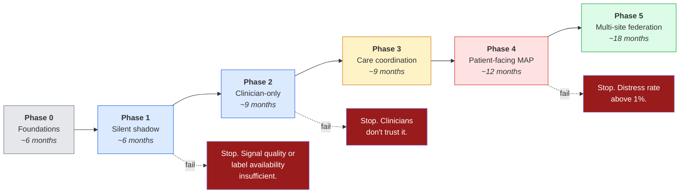

# 11. Implementation Roadmap

> ⚠️ Reference architecture only. Timeframes are 🟡 **illustrative planning estimates**, not
> commitments. See [`../DISCLAIMER.md`](../DISCLAIMER.md).

Healthcare organisations are full of well-validated tools nobody touches, because deployment got
treated as an afterthought rather than a discipline of its own. This roadmap exists so that each phase
has to **earn** the next.

---

## 11.0 Sequencing principle: lowest fidelity first

The phases below are ordered so that **the cheapest deployable configuration ships first and the
most expensive, least-evidenced one ships last and conditionally**
([ADR-0011](adr/0011-non-neural-core.md)).

| Order | Fidelity tier | Rationale |
|---|---|---|
| 1st | **T0 / T1** | Reachable everywhere, aligns with existing care-management reimbursement, and can move the caregiver endpoints that gate release |
| 2nd | **T2** | Adds conversion-risk stratification once the workflow is proven |
| 3rd | **T3** | Only where funded and staffed, and **only if the §7.6 ablation shows the neural channel adds measurable value** |

If the ablation returns a negative result, T3 is never built, and that is a successful outcome of
the programme rather than a failure of it.

## 11.1 Six phases

**The stop conditions are real.** A roadmap where every phase leads inevitably to the next is a plan,
not a gate.

## 11.2 Phase detail

### Phase 0 — Foundations (no patients)

| | |
|---|---|
| **Goal** | Build the plumbing and the governance before anyone is enrolled. |
| **Scope** | FHIR R5 server; consent service; twin state store; edge app skeleton; audit log; model registry; the six named roles filled by actual named people. |
| **Deliverables** | Working local system on synthetic data (this repository is roughly Phase 0's technical artefact); DPIA; IRB submission; alert-ceiling conversation started with the nurse-navigator team. |
| **Go criteria** | All six roles named. IRB approved. DPIA signed. Synthetic end-to-end pipeline passes tests. |
| **Common failure** | Starting model development before the consent and audit infrastructure exists, then retrofitting it. |

### Phase 1 — Silent shadow (R1)

| | |
|---|---|
| **Goal** | Find out whether real-world signal quality and label availability support the model at all. |
| **Scope** | Consented enrolment, EEG + neuropsych + EHR ingestion. Model runs. **No output reaches any human.** |
| **Cohort 🟡** | ~50 patients, one memory clinic, minimum 12 months follow-up. |
| **Measures** | Signal quality distribution in the wild; conversion label availability; B1.1–B1.3 on retrospective + prospective data; subgroup enrolment adequacy. |
| **Go criteria** | B1.1 ≥ 80%, B1.2 ≤ 20%, **B1.3 ≤ 10 pts**, and every intended subgroup has n ≥ 30 *or* the intended population is narrowed in writing. |
| **Stop condition** | Ambulatory signal quality below usable threshold in the majority of recordings, or conversion labels unobtainable at usable rates. **Stop and publish the negative result.** |

### Phase 2 — Clinician-only passive flag (R1 Release 1–2)

| | |
|---|---|
| **Goal** | Let clinicians build trust in the reasoning before the score touches any workflow decision. |
| **Scope** | Score + top features visible to the memory-clinic physician via SMART on FHIR. **No automated action attached at all.** Then Release 2: joins the shared care-coordination dashboard; high-risk flag triggers an *optional* nurse outreach call. |
| **Measures** | Clinician-reported trust and usefulness; how often the score is opened; whether it changes documented reasoning; explanation-coverage B1.5. |
| **Go criteria** | Benchmarks clear for **two consecutive quarters**; clinicians report they understand and can challenge the reasoning; no unresolved fairness finding. |
| **Stop condition** | Clinicians consistently ignore it, or report the explanations are not intelligible. That is a real result, not a training problem to be solved with more training. |

### Phase 3 — Care coordination and home monitoring (R2)

| | |
|---|---|
| **Goal** | Continuous baseline-deviation monitoring, sustainably. |
| **Scope** | Wearable gait/HRV ingestion; personal baseline establishment; deviation alerts into the existing nurse dashboard; Alert Budget Governor live. Then Release 3: EHR risk panel entry + **family app**. |
| **Measures** | B2.1 (48 h detection), **B2.2 (alert volume within the pre-agreed ceiling)**, B2.3 precision, B2.5 suppression audit, caregiver burden trend. |
| **Go criteria** | Alert volume within ceiling for two consecutive quarters; suppression audit clean; family-app materials approved by the patient-and-family advisory council. |
| **Stop condition** | Alert volume cannot be brought within the ceiling without unacceptable precision loss. Renegotiate the ceiling **with the team** — do not silently raise it. |

### Phase 4 — Patient-facing Memory Anchoring Pipeline (R3)

The highest-risk phase, run in three sub-stages.

| Sub-phase | Description | Exit criterion |
|---|---|---|
| **4A — Silent** | System decides but delivers nothing. Caregiver independently logs receptive moments. | B3.5 precision ≥ 65% against caregiver ground truth |
| **4B — Supervised** | Caregiver present and can veto any cue before it fires. | **Zero distress events across ≥ 100 delivered cues** |
| **4C — Independent** | Home use without supervision. | B3.2 distress ≤ 1% sustained; B3.1 latency < 2 s p95 |

| | |
|---|---|
| **Go criteria** | 4B's zero-distress requirement is absolute. Not "low". Zero. |
| **Stop condition** | Distress rate above 1% at any point in 4C → immediate suspension of independent use, return to 4B. |
| **Critical experiment** | Run the **neural-channel ablation** here ([§7.6](07-validation-and-benchmarks.md#76-the-weakest-link)). If context + content alone perform equivalently, drop the EEG headset and simplify the whole system. Publish either result. |

### Phase 5 — Multi-site federation

| | |
|---|---|
| **Goal** | Improve model robustness across populations without centralising patient data. |
| **Scope** | Federated learning coordinator; secure aggregation; differential privacy; cross-site validation. |
| **Go criteria** | ≥ 3 sites with materially different population profiles; cross-site fairness gate passes at every site individually, not only in aggregate. |
| **Note** | Almost no single institution has enough patients to train something robust alone (🔵 [5]). Federation is how that is addressed without creating a central honeypot of neural data. |

## 11.3 Cross-cutting workstreams

These run continuously, not as phases:

| Workstream | Cadence |
|---|---|
| Clinician training on interpreting **this system's** outputs | **Recurring**, not one-time at go-live |
| Patient-and-family advisory council review | Every release touching patient-facing material |
| Fairness gate | Every model build, automatically in CI |
| Drift monitoring | Continuous from Phase 2 |
| Alert ceiling review | Quarterly, with the receiving team |
| Consent re-confirmation | Per the cycles in [§8.5](08-security-and-privacy.md#85-consent-architecture) |
| Publishing results — **including negative ones** | Per phase |

## 11.3a What would make me drop a fidelity tier

Distinct from abandoning the architecture. Dropping a tier is a normal, expected outcome.

- **Drop T3** if the sham-controlled ablation in [§7.6](07-validation-and-benchmarks.md#76-the-weakest-link)
  shows that disabling the neural channel does not degrade opportunity-detection precision. The
  MAP is then rebuilt on T2 signals or retired.
- **Drop T2** if prospective evaluation shows a T1 configuration matches T2 on conversion risk. The
  wristband becomes optional and the product gets cheaper.
- **Never drop T0.** It is the only configuration reachable in the settings where most people with
  dementia now live.

## 11.4 What would make me abandon this architecture

A roadmap should say what disconfirmation looks like.

| Finding | Implication |
|---|---|
| Neural-channel ablation shows no benefit | Drop EEG entirely. The system becomes simpler, cheaper, less invasive and better. This would be a **good** outcome. |
| Ambulatory EEG quality is unusable in the majority of real recordings | R1 and R3's neural components are not viable with current consumer hardware. |
| Subgroup gap cannot be closed below 10 points with available data | The tool cannot be deployed equitably. Narrow the population in writing or stop. |
| Alert volume cannot be made sustainable at acceptable precision | R2 is not viable in this organisation's staffing model. |
| Distress rate stays above 1% in supervised use | R3 should not proceed to independent use, possibly ever. |
| Clinicians do not act differently even when they trust the score | The information was not decision-relevant. The requirement was wrong. |

## 11.5 Where to go next

- The benchmarks each gate tests: [§7 Validation](07-validation-and-benchmarks.md)
- Who signs off at each gate: [§10 Governance](10-governance-and-ethics.md)
